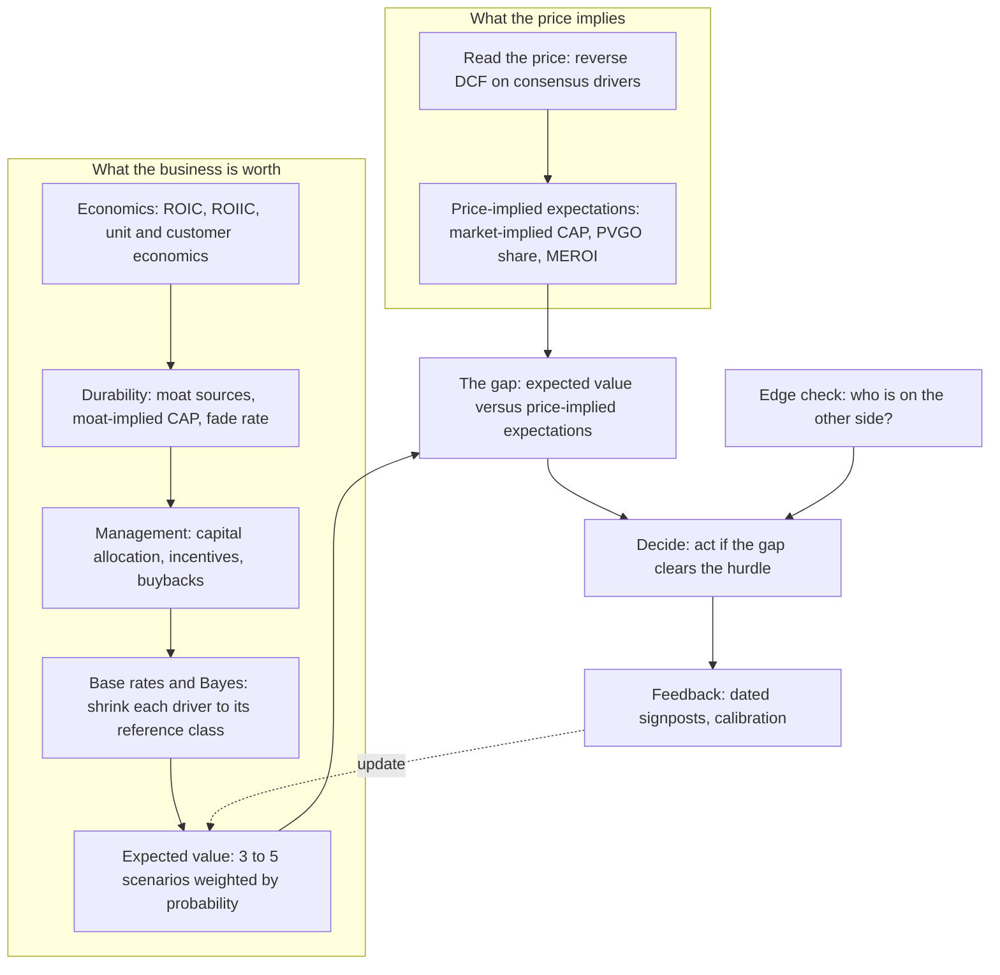
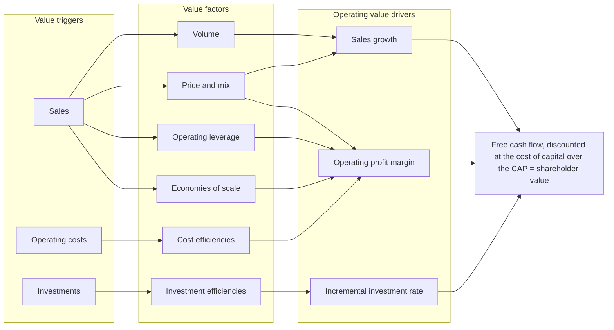

# Mauboussin's Frameworks: A Study Report

2026-10-07 · Prepared for Karthik Gajjala · Live, editable version with the section 15 decision tracker: [Claude Doc](https://claude.ai/code/artifact/7ebca9ce-2330-46e4-9d86-f4eae0d9e671)

Michael Mauboussin's work reduces to one discipline: **estimate what the price already expects, rebuild the business's economics from the unit up, ground every forecast in base rates, and act only when expected value differs from price for a reason you can name.** This report sets out each framework with its formulas, data and sources, then maps them against our v5 investment framework so we can decide what to adopt.

## 0. How to use this report

**What was read.** All 45 *Consilient Observer* reports on Morgan Stanley's site (March 2020 to September 2026), extracted from the primary PDFs and read in full or in their key sections; *The Base Rate Book* (2016); *Total Addressable Market* (2015); and *Thirty Years: Ten Attributes of Great Investors* (2016). The four published books are summarized from their content as restated in these reports, the book sites and my prior knowledge of them; I did not re-read the books cover to cover in this session, so book-only details carry less verification than report figures. *The Investing Mind* is not out until 24 November 2026. Older CSFB and Legg Mason pieces are covered through the editions that replaced them.

**How it is organized.** Sections 1–2 give context and the architecture. Sections 3–13 each cover one body of work and end with a one-line **takeaway for our process**. Section 14 turns everything into a ten-step workflow. Section 15 is the gap analysis against our framework, with a Decision column for our working session. Sections 16–17 are the study plan and bibliography.

### The system on one page

1. **Value is the present value of free cash flow**, and growth adds value only when the return on new investment exceeds the cost of capital. Growth at the cost of capital is a treadmill; below it, growth destroys value (section 3).
2. **Multiples are shorthand, not valuation.** They hide the drivers (growth, ROIIC, CAP, discount rate), and intangibles now distort them badly. Earn the right to use a multiple by tying it to the drivers (section 3.5).
3. **Read the price before forecasting.** Reverse-engineer the market-implied competitive advantage period with a fade-model terminal value; typical stocks imply 5–20 years (section 5).
4. **Value = steady state + growth opportunities.** About a third of the S&P 500's price has historically been future value creation; low-PVGO stocks have outperformed (section 3.3).
5. **ROIC must be built carefully and read as an answer to a stated question.** The money is in unexpected *changes* in ROIC; ROIC fades at sector-specific rates (fade 0.10 for staples, 0.30 for utilities) (sections 4, 5.4).
6. **The moat is the CAP.** Analyze industry entry and rivalry, disruption, and how the firm raises willingness to pay or lowers willingness to sell; durable high returns come mostly from differentiation (section 6).
7. **Start every forecast from a base rate** and regress toward it by 1 − r. Margins persist; growth rates barely do; forecasts are too narrow and too optimistic (section 7).
8. **Unit economics decide early-stage value.** Customer value must be modelled by cohort and down to shareholder value, not stopped at LTV/CAC (section 8).
9. **Capital allocation is the CEO's main job.** Buybacks only transfer wealth; they help continuing holders only below value and when no better use exists. Judge M&A by synergy NPV against the premium, not EPS (section 9).
10. **Edge needs a counterparty.** Ask who is on the other side and which source (behavioral, analytical, informational, technical) explains the gap and how it will close (section 10).
11. **Separate skill from luck.** Judge decisions by process, write probabilities rather than adjectives, and score dated signposts (sections 11–12).
12. **Wealth creation is extremely skewed** and even the best compounders suffer 70–90% drawdowns; terminal values should reflect that companies die (sections 7.7, 13).

## 1. Who Mauboussin is and how his work evolved

Michael J. Mauboussin has spent four decades turning academic finance, strategy and decision science into tools a practitioner can use on a single stock. He is Head of Consilient Research at Counterpoint Global (Morgan Stanley Investment Management), has taught at Columbia Business School since 1993, and is chairman emeritus of the Santa Fe Institute ([bio](https://www.michaelmauboussin.com/about)).

His career explains his method. He started at Drexel Burnham Lambert in 1986 and joined First Boston in 1992 as a packaged-food analyst ([Wikipedia](https://en.wikipedia.org/wiki/Michael_J._Mauboussin)). As a sell-side analyst he absorbed Alfred Rappaport's shareholder-value school; at Legg Mason he worked beside Bill Miller and the Santa Fe Institute's complexity thinkers; at Credit Suisse he had the HOLT database of 60+ years of corporate results. Each environment left a layer in the frameworks below.

| Years | Firm and role | What that era added | Representative work |
| --- | --- | --- | --- |
| 2020 to now | Counterpoint Global, MSIM: Head of Consilient Research | Rewrites of the canon for an intangible-heavy economy; base rates with Bayes; capital allocation; market structure | \~45 *Consilient Observer* reports, e.g. [Measuring the Moat](https://www.morganstanley.com/content/dam/im/assets/publication/thought-leadership/consilient-observer/article_measuringthemoat.pdf) (2024), [Capital Allocation](https://www.morganstanley.com/content/dam/im/assets/publication/thought-leadership/consilient-observer/article_capitalallocation.pdf) (2025), [Competitive Advantage Period](https://www.morganstanley.com/content/dam/im/assets/publication/thought-leadership/consilient-observer/article_theneglectedvaluedriver_ltr.pdf) (2026) |
| 2018 to 2020 | BlueMountain Capital: Director of Research | Market efficiency and where edge comes from | *Who Is on the Other Side?* (2019, the origin of BAIT; rewritten 2026) |
| 2013 to 2018 | Credit Suisse: Head of Global Financial Strategies | Empirical base rates from the HOLT database; ROIC, multiples and capital allocation as measurable objects | *The Base Rate Book* (2016), *Capital Allocation* (2015), *Total Addressable Market* (2015), *Thirty Years: Ten Attributes of Great Investors* (2016) |
| 2004 to 2013 | Legg Mason Capital Management: Chief Investment Strategist | Complexity, skill versus luck, behavioural decision-making | *Mauboussin on Strategy* series; *Think Twice* (2009); *The Success Equation* (2012) |
| 1992 to 2004 | First Boston / CSFB: food analyst, then Chief U.S. Investment Strategist | Shareholder-value economics: CAP, ROIC, real options, moats | *Frontiers of Finance* series: *Competitive Advantage Period* (1997), *Get Real* (1999), *Measuring the Moat* (2002); *Expectations Investing* (2001) |

### The books

| Book | Year | Core contribution | Where it lands in this report |
| --- | --- | --- | --- |
| *Expectations Investing* (with Alfred Rappaport) | 2001; revised 2021 | Read the expectations in the price, then find where they will be revised | Sections 3 and 5 |
| *More Than You Know* | 2006; expanded 2008 | Essays on investment philosophy, psychology, innovation and complexity | Sections 10 and 12 |
| *Think Twice* | 2009 | Eight decision traps and how to counter them | Section 12 |
| *The Success Equation* | 2012 | Untangling skill from luck; reversion to the mean; the paradox of skill | Section 11 |
| *The Investing Mind* | Due 24 Nov 2026 (Harriman House) | The ten attributes of successful investors, expanded from his 2016 essay | Section 12 (from the 2016 essay; the book is not yet out) |

The newest book was announced on [theinvestingmind.com](https://theinvestingmind.com) and the [Harriman House page](https://www.harriman-house.com/authors/michael-j-mauboussin/the-investing-mind/9781804094273). Its listed themes are numeracy, capital allocation, risk versus reward, strategy assessment, bias and open-mindedness.

### How to read his corpus

He revisits his core topics every few years and the newest version supersedes the old. *Measuring the Moat* exists in 2002, 2013, 2016 and 2024 editions; *Competitive Advantage Period* in 1997 and 2026; *Who Is on the Other Side?* in 2019 and 2026. This report uses the latest edition of each and notes where an older one adds something.

Most recent reports are co-written with Dan Callahan. Earlier collaborators include Alfred Rappaport (expectations), Paul Johnson (CAP) and the Credit Suisse HOLT team (base rates).

## 2. The architecture: one equation, four questions, one decision

Mauboussin's frameworks are not a list of tools; they hang off a single valuation identity and a single decision rule. The identity, from Miller and Modigliani via Rappaport, splits any company's value into what it is worth if it stops creating value and what its future investments add:

$$
\text{Value} = \underbrace{\frac{\text{NOPAT}}{\text{WACC}}}_{\text{steady state}} + \underbrace{\frac{\text{Investment} \times (\text{ROIC} - \text{WACC}) \times \text{CAP}}{\text{WACC} \times (1 + \text{WACC})}}_{\text{present value of growth opportunities}}
$$

Every major body of his work estimates one term of this equation, or the gap between the market's estimate and yours:

| Question | Term it estimates | Main frameworks | Report sections |
| --- | --- | --- | --- |
| What does the price already assume? | All terms, as the market sees them | Price-implied expectations, market-implied CAP, PVGO share, MEROI | 3, 5 |
| How much does the business earn on new capital? | ROIC − WACC (the spread) | ROIC build, intangibles, ROIIC, unit and customer economics | 4, 8 |
| How much can it invest, and for how long? | Investment and CAP | Moat analysis, fade rates, increasing returns, TAM, life cycle | 5, 6, 8 |
| What will management do with the cash? | Investment quality and per-share value | Capital allocation, buybacks, M&A, SBC, incentives | 9 |
| How likely is a revision, and why would the market be wrong? | The gap between your estimate and the market's | Base rates and Bayes, BAIT, skill and luck, decision discipline | 7, 10, 11, 12 |

*How the frameworks connect · synthesis of sections 3–14*

The left lane is read from the price; the right lane is built from the business and disciplined by base rates. Only the gap between them, checked for a reason it should close, leads to action, and the results feed back into the next estimate.

Three ideas recur across all of it:

1. **Price versus value, expectations versus fundamentals.** A great company is not a great stock unless results beat what the price implies ("great businesses are not always great stocks"). Excess returns come only from revisions in expectations.
2. **The outside view disciplines the inside view.** Every forecast of growth, margins, ROIC fade, M&A success or a turnaround starts from a reference class and moves away only for stated reasons, by an amount set by how persistent the measure is.
3. **Probabilistic thinking and process.** Value is an expected value across scenarios; outcomes are noisy, so decisions are judged by process, with explicit probabilities, signposts and feedback.

The decision rule follows from these: **buy when expected value exceeds price by enough to compensate for the time and uncertainty of convergence; sell when price exceeds expected value or a larger gap exists elsewhere.** Our 13% hurdle on the probability-weighted value is one concrete version of that rule.

## 3. The economics of value creation

Everything in Mauboussin starts from one sentence: the value of a financial asset is the present value of the cash it will distribute, and growth adds value only when the return on new investment beats the cost of capital ([The Math of Value and Growth](https://www.morganstanley.com/content/dam/im/assets/publication/thought-leadership/consilient-observer/article_themathofvalueandgrowth.pdf), 2020). Multiples, factor labels and "value versus growth" are shorthands that hide those drivers.

### 3.1 Free cash flow and the three value drivers

Free cash flow is net operating profit after tax (NOPAT) minus investment in future growth. Investment includes working capital, capital spending net of depreciation, acquisitions and, in economic substance, the intangible spending that accounting expenses.

$$
\text{FCF} = \text{NOPAT} - \text{Investment}, \qquad \text{NOPAT} = \text{EBIT}\,(1 - t)
$$

Three drivers set value: **growth**, **return on incremental invested capital (ROIIC)** and the **discount rate**. ROIIC tells you how much must be reinvested to buy a given growth rate, so it decides how much cash is left for owners.

$$
\text{Reinvestment rate} = \frac{g}{\text{ROIIC}}, \qquad \text{FCF} = \text{NOPAT}\left(1 - \frac{g}{\text{ROIIC}}\right)
$$

### 3.2 The commodity multiple and the sensitivity of multiples to growth

The **commodity P/E** is what $1 of perpetual earnings is worth with no value creation: 1 divided by the cost of equity. At an 8% cost of equity it is 12.5. It ranged from 5.1 (1981) to 16.7 (mid-2020) and averaged 10.7 over 1961–2020; the S&P 500 traded about 35% above it on average.

Mauboussin's calibration (15-year forecast, perpetuity terminal, 6.7% cost of equity) shows how violently warranted multiples respond to drivers that barely move next year's earnings:

| Change in assumption | Next-year EPS change | Warranted P/E change |
| --- | --- | --- |
| Growth 10% → 15% (ROIIC 20%) | +4.5% | 32.3 → 52.2 |
| Growth 10% → 7% (ROIIC 20%) | −2.7% | 32.3 → 24.9 (−22.9%) |
| Growth 15% → 12% (ROIIC 20%) | −2.6% | 52.2 → 39.0 (−25.3%) |
| ROIIC = cost of capital (6.7%), any growth | — | 14.9 (the commodity multiple) |
| ROIIC below cost of capital | — | Below 14.9, and falls faster the faster it grows |

Two lessons follow. The P/E is **convex in growth** when ROIIC is high, so an apparently "overdone" reaction to a small estimate cut can be fully rational if the growth trajectory has shifted. And growth is **worthless at a return equal to the cost of capital and destructive below it**, which is why acquisitions often add to EPS while subtracting from value.

High-ROIIC, high-reinvestment businesses are **long-duration assets**: more of their value sits far out, so they are more sensitive to the discount rate. Market P/Es follow an inverted U against real rates, highest in the middle of the range ([Math of Value and Growth](https://www.morganstanley.com/content/dam/im/assets/publication/thought-leadership/consilient-observer/article_themathofvalueandgrowth.pdf), exhibit 2). Bruce Greenwald's warning closes the report: ROIIC eventually fades to the cost of capital, and "in the long run, everything is a toaster."

### 3.3 Steady-state value plus growth opportunities (PVGO)

Miller and Modigliani split value into what the business is worth if it stops creating value, plus the option to make value-creating investments ([Market-Expected Return on Investment](https://www.morganstanley.com/content/dam/im/assets/publication/thought-leadership/consilient-observer/article_marketexpectedreturnoninvestment_en.pdf), 2021).

$$
\text{Corporate value} = \underbrace{\frac{\text{NOPAT}_{1}}{\text{WACC}}}_{\text{steady state}} + \text{PVGO}, \qquad \text{PVGO\%} = 1 - \frac{\text{NOPAT}/\text{WACC} - \text{net debt}}{\text{equity market value}}
$$

The **PVGO share of price is a direct read of expectations** ([Opportunities and Expectations](https://www.morganstanley.com/content/dam/im/assets/publication/thought-leadership/consilient-observer/article_opportunitiesandexpectations_ltr.pdf), June 2026):

- For the S&P 500, 1961–2025, PVGO averaged **35% of price**; it was near zero in 1974 and 2011 and peaked around 1999–2001. At end-2025 it was well above average.
- The lowest PVGO quartile was followed by an 11.6% ten-year annual TSR versus 7.6% for the highest. The correlation is only −0.26: useful at extremes, weak as a timing tool.
- For U.S. stocks over $1B (1990–2024), the low-PVGO half beat the high-PVGO half by **2.6 points a year over five years**, positive in about 90% of years, and beat the Fama-French value factor by 2.3 points.
- Worked example: NOPAT $100, WACC 8%, net debt $250, equity value $1,500 → steady-state equity $1,000 → PVGO 33%.

### 3.4 Market-expected return on investment (MEROI)

MEROI is the return on all future investment that today's price implies: the rate at which the present value of capitalized NOPAT increments equals the present value of the investments (discounted at the cost of capital). It answers "how high is the bar?"

- In the model case (8% growth, 25% ROIIC, 7% cost of capital), value is $2,230.8: $1,428.6 steady state and $802.2 PVGO. MEROI is 16.2%.
- For Microsoft at July 2003, MEROI was 27.1% on reported numbers and 18.1% after capitalizing intangibles, against a 9.5% cost of equity. **Great businesses are not always great stocks**: the price already demands far more than the cost of capital.
- **ROIIC overstates the economic return of high-return businesses and understates it for low-return ones**, and the bias grows with the competitive advantage period. ROIIC captures only the "dividend" of value added, not the change in continuing value. Use rolling three- or five-year ROIIC, never one year.
- Common return measures ranked: ROE is "at best a very crude indicator" (leverage, buybacks and intangibles distort it; Home Depot had negative equity in fiscal 2020). ROIC has a sound numerator and is "one of the best of the accounting measures." IRR assumes reinvestment at the IRR; a 20% IRR with interim cash flows reinvested at 7% is really 14%.
- Free cash flow and economic-profit models give identical values; they only allocate value differently between "existing" and "new."

### 3.5 What multiples mean, and what they miss

Multiples are "a shorthand for the valuation process" and "you have to earn the right to use a multiple" by showing its link to value ([Everything Is a DCF Model](https://www.morganstanley.com/content/dam/im/assets/publication/thought-leadership/consilient-observer/article_everythingisadcfmodel_us.pdf), 2021). In a CFA Institute survey of \~2,000 analysts, 93% use multiples (88% P/E, 77% EV/EBITDA); and in DCFs that 79% also build, the continuing value is commonly over 75% of the total, often set by an exit multiple: "multiples analysis dressed up as a DCF model" ([Valuation Multiples](https://www.morganstanley.com/content/dam/im/assets/publication/thought-leadership/consilient-observer/article_valuationmultiples.pdf), 2024).

What multiples miss:

- **Investment needs and returns.** Two companies with the same EPS level and growth but different ROICs deserve different P/Es.
- **Intangibles.** SG&A is "practically unmatched to revenues" for firms listed since the 1990s (Srivastava). Capitalizing Microsoft's intangible investment raised fiscal-2023 net income 14.7% and EBITDA 43.6%; trailing P/E fell from 34.9 to 30.5 and EV/EBITDA from 24.2 to 16.9.
- **Capital structure, cash, taxes and non-operating items**, which move P/E but not EV/EBITDA. Walmart and Apple both traded at \~25.5 forward P/E in March 2024, but at 13.3 versus 20.1 EV/EBITDA, explained by Walmart's lower ROIC, net debt and a tax rate 10 points higher.

The **depreciation factor** (EBITDA ÷ EBIT) matters when you price on EV/EBITDA: D&A proxies maintenance capex, so for the same EBITDA the firm with more EBIT is worth more. Median factors run 1.3 (consumer discretionary) to 1.8 (utilities), 1.4 overall, and they correlate −0.50 with the ROIC–WACC spread. Amortization of acquired intangibles rose from \~2% to \~20% of D&A over 1984–2023.

The Gordon-model bridge from drivers to multiples:

$$
\frac{EV}{EBITDA} = \frac{(1-t) + t\,\frac{D}{EBITDA} - \frac{\text{Capex}}{EBITDA} - \frac{\Delta WC}{EBITDA}}{\text{WACC} - g}
$$

With sales $500, EBIT $100, D&A $25, tax 15%, capex $31.25, WACC 8.5% and growth 4%, EV is $1,750: 14.0× EBITDA, 20.6× earnings and 3.5× sales. Stocks trading below their driver-warranted multiple subsequently earned positive excess returns, and those above it negative ones.

### 3.6 Negative free cash flow can be good

"Negative FCF is fine provided ROIC exceeds the cost of capital" ([To Free or Not to Free (Cash Flow)](https://www.morganstanley.com/content/dam/im/assets/publication/thought-leadership/consilient-observer/article_tofreeornottofree_ltr.pdf), September 2026). Walmart had negative FCF in every year from 1973 to 1986 while ROIC averaged 18%; the stock compounded 33% a year, three times the S&P 500. The 2026 report applies this to the hyperscalers, whose combined trailing FCF swings from about +$170B (Q1 2024) to a forecast trough near −$265B (Q3 2027) before recovering to about $505B by 2030, with ROIIC above the cost of capital throughout. Three practical refinements from that report:

- **Subtract stock-based compensation** from cash flow from operations before computing FCF; it is a financing transaction paired with a compensation payment. This cuts operating cash flow 10–20% for large tech companies.
- **Lag ROIIC by a year and smooth it over three**: ROIIC for 2026 = (NOPAT 2026 − NOPAT 2023) ÷ (invested capital 2025 − invested capital 2022).
- **Watch whether revisions to sales and EBIT keep pace with revisions to capex**; that is the live test of whether a capex surge is value-creating.

### 3.7 The discount rate and real options

The cost of capital is opportunity cost: "what could I reasonably expect to earn for an asset of similar risk?" Mauboussin's [Cost of Capital](https://www.morganstanley.com/content/dam/im/assets/publication/thought-leadership/consilient-observer/article_costofcapital.pdf) (2023) is a practical CAPM guide: 10-year Treasury as the risk-free rate, a forward-looking implied equity risk premium (Damodaran's monthly estimate), adjusted or industry betas, market-value weights. High-cost-of-capital periods are followed by above-normal returns. Importantly for a fixed hurdle, he notes a portfolio's **required rate of return can be used in lieu of WACC** to test whether an investment clears the bar.

Real options deserve separate valuation only for a minority of companies ([WACC and Vol](https://www.morganstanley.com/content/dam/im/assets/publication/thought-leadership/consilient-observer/articles_waccandvol.pdf), 2020). Value current operations with a DCF, then ask two questions from *Expectations Investing* (p. 128): how much real-option potential the business has (management that can identify and exercise options, a leading industry position, high and evolving uncertainty) and how much the price imputes.

|  | Low potential | High potential |
| --- | --- | --- |
| **High value imputed in price** | Sell candidate | Real-options analysis required |
| **Low value imputed in price** | No real-options analysis needed | Buy candidate (the option is free) |

Option value rises with volatility and option life, as in Black-Scholes (project value, cost, asset volatility, life, risk-free rate).

**Takeaway for our process.** Our §5 already prices optionality as its own line and reads implied expectations. Mauboussin adds three sharper tools: the PVGO share of price as a one-line expectations gauge, a warranted-multiple check that ties the terminal multiple to ROIC and growth, and the rule that ROIIC must be smoothed, lagged and treated as an upper bound on the economic return.

## 4. Measuring ROIC, investment and reinvestment

ROIC is the bridge from accounting to value, but only if it is built consistently and read as the answer to a stated question. Mauboussin's four Counterpoint reports on the subject ([Return on Invested Capital](https://www.morganstanley.com/content/dam/im/assets/publication/thought-leadership/consilient-observer/article_returnoninvestedcapital.pdf), 2022; [ROIC and Intangible Assets](https://www.morganstanley.com/content/dam/im/assets/publication/thought-leadership/consilient-observer/article_roicandintangibleassets_us.pdf), 2022; [ROIC and the Investment Process](https://www.morganstanley.com/content/dam/im/assets/publication/thought-leadership/consilient-observer/article_roicandtheinvestmentprocess.pdf), 2023; [Underestimating the Red Queen](https://www.morganstanley.com/content/dam/im/assets/publication/thought-leadership/consilient-observer/article_underestimatingtheredqueen.pdf), 2022) amount to a house manual.

### 4.1 The one-dollar test

A company creates value when $1 invested becomes worth more than $1 in the market. If $10,000 earns $500 a year forever at an 8% opportunity cost, it is worth $6,250: profitable but value-destroying. At $800 it is worth exactly $10,000 and growth is "like the speed setting on a treadmill." At $1,100 it is worth $13,750 and faster growth is better. Across the top 500 U.S. companies, ROIC minus WACC correlates 0.58 with enterprise value to invested capital, rising to **0.78 once expected growth is added**.

### 4.2 Building NOPAT and invested capital

$$
\text{ROIC} = \frac{\text{NOPAT}}{\text{Invested capital}}, \qquad \text{NOPAT} = \text{EBITA} - \text{cash taxes} \approx \text{EBITA}\,(1 - \text{cash tax rate})
$$

- **EBITA, not EBIT.** Add back amortization of *acquired* intangibles: the company already expenses the spending that maintains those assets, so amortization would penalize it twice. Add back the interest embedded in operating-lease expense.
- **Cash taxes** = provision − increase in net deferred tax liabilities + the interest tax shield (so every company is taxed as if unlevered). Cash taxes ran about 95% of reported taxes in 2021.
- **Invested capital: prefer the operating approach** (net working capital + net PP&E + right-of-use assets + acquired intangibles + goodwill + other operating assets). The financing approach (debt + leases + equity + equity equivalents) gives the same total but hides excess cash and asset efficiency.
- **Excess cash out.** Keep about 2% of revenue as operating cash (up to 5% for less predictable or faster-growing firms). Including all of Microsoft's cash would cut its fiscal-2022 ROIC from 49% to 29%. For valuation, add *all* cash back to firm value.
- **Buybacks do not change ROIC** once excess cash is stripped; they change ROE and book value per share, neither of which matters economically.
- **Goodwill impairments: add them back** so management stays accountable for past deals (it cuts Microsoft's ROIC by \~3.5 points). Strip restructuring accounting but keep its capex; add back serial write-offs.

### 4.3 Four ROICs, four questions

The same company can show ROIC from 34% to 94% depending on what you ask. Pick the question first and use it everywhere.

| Calculation | Microsoft FY2022 | Question it answers |
| --- | --- | --- |
| Excl. acquired goodwill and intangibles; no intangible capitalization | 94% | What is the organic return on tangible capital? |
| As reported (goodwill in; no capitalization) | 49% | What does the reported record show? |
| Excl. goodwill; intangibles capitalized | 48% | What is the organic return including intangible investment? |
| Goodwill in; intangibles capitalized | 34% | What is the all-in return on every dollar invested, bought or built? |

### 4.4 Capitalizing intangible investment

Intangible investment (R&D, brand, customer acquisition, training, software) passed tangible capex around 2000; Russell 3000 companies spent about $1.8T on intangibles in 2020 versus $800B of capex. Accounting expenses most of it, so earnings and invested capital are both understated and multiples lose meaning.

- **Method.** Decide what share of R&D and SG&A is discretionary investment, capitalize it, amortize it over a useful life, and rebuild the opening stock with the perpetual inventory method. Free cash flow does not change; NOPAT and investment rise by the same amount.
- **Parameters.** Microsoft (Hulten): R&D 100% over 6 years, sales and marketing 70% over 2 years, G&A 20% over 2 years. Academic default (Peters and Taylor): all R&D plus 30% of other SG&A. Mauboussin's preferred industry-specific table (Iqbal, Rajgopal, Srivastava, Zhao) averages **54% of main SG&A and 76% of R&D**, with lives of **3.3 and 4.4 years** ([Intangibles and Earnings](https://www.morganstanley.com/content/dam/im/assets/publication/thought-leadership/consilient-observer/article_intangiblesandearnings_us.pdf), 2022, appendix A).
- **Effects.** S&P 500 earnings would be \~12% higher. Amazon's 2021 net income rises from $33.4B to $61.5B and EBITDA roughly doubles. Microsoft's ROIC falls from 49% to 34%; Snowflake's goes from −416% to +3%. **Highs fall and lows rise**: dispersion shrinks, and "superstar" firms look much less exceptional.
- **Good losses versus bad losses** ([Good Losses, Bad Losses](https://www.morganstanley.com/content/dam/im/assets/publication/thought-leadership/consilient-observer/article_goodlossesbadlosses.pdf), 2022). About a third of Russell 3000 companies reported losses in 2021. Capitalizing intangibles flips \~40% of losses to profits. Matched 1980–2017, $1 grew to **$20.82 in "GAAP losers"** (losses caused by expensed investment), $7.65 in profitable firms and $1.90 in "real losers."
- **Recut the cash flow statement** ([Categorizing for Clarity](https://www.morganstanley.com/content/dam/im/assets/publication/thought-leadership/consilient-observer/article_categorizingforclarity.pdf), 2021): move stock-based compensation to financing, leases to investing and intangible investment to investing. Amazon's 2020 operating cash flow rises 53% and investing outflow 92%; FCF is unchanged. SBC runs \~15% of sales for the smallest Russell 1000 companies and \~1% for the largest.

### 4.5 Maintenance versus growth investment (the Red Queen)

Growth forecasts are only as good as the split between spending that keeps the business in place and spending that moves it forward. Mauboussin's evidence says most investors overstate the growth share.

- **Depreciation understates maintenance capex by about 20%** in aggregate (Peddireddy, 1974–2016), because of technological obsolescence and inflation. Firms that underestimate maintenance later post write-offs, weaker earnings and negative abnormal returns.
- **Peddireddy's estimate:** cumulative capacity cost (D&A + write-downs + losses on asset sales + impairments, five years) ÷ five-year sales × current sales.
- **Greenwald's estimate, extended by Mauboussin:** growth investment = five-year average (net tangible + net capitalized intangible assets) ÷ sales × the change in sales; maintenance = total investment (capex, capitalized intangibles, M&A) minus growth. For Microsoft it gave **38% growth and 62% maintenance** over five years.
- **Part of R&D is maintenance**, especially at large tech companies that must ship new versions to stand still.
- **Watch useful-life changes.** Amazon's 2020 move from three- to four-year server lives cut D&A by $2.7B and added $2.0B to net income, about 10%.
- Intangible-intensive firms grow faster with more variance; long high-intangible, short low-intangible earned 4.6 points a year from 1989 to 2020.

### 4.6 Incremental returns and the growth identity

$$
\text{ROIIC}_{3yr} = \frac{\text{NOPAT}_{t} - \text{NOPAT}_{t-3}}{\text{IC}_{t-1} - \text{IC}_{t-4}}, \qquad g_{\text{self-funded}} = \text{ROIC} \times (1 - \text{payout ratio})
$$

ROIIC lags investment by a year and should be smoothed over three or five years; one-year figures are noise, and an acquisition (LinkedIn, Activision) swamps them. High ROIIC usually signals capital efficiency or operating leverage, which investors are poor at anticipating. Treat it as a pointer to change, not a return to compare with WACC (section 3.4). A company can grow faster than its ROIC only with outside capital, as Walmart did for its first dozen public years at about twice its ROIC.

### 4.7 What the data say about ROIC

| Finding | Number | Source |
| --- | --- | --- |
| Most common ROIC band (Russell 3000, 2021) | 5–10%; \~30% of firms below −20% or above 30% | ROIC (2022) |
| Aggregate ROIC trend, 1990–2021 | 7.6% → 11.4%; larger firms earn more | ROIC (2022) |
| Economic profit concentration, 2018–2022 | Top decile +$890B a year, bottom −$270B, middle eight deciles +$103B | ROIC and the Investment Process (2023) |
| Top-quintile ROIC firms three years later | 48% still top quintile, 15% bottom | same |
| Bottom-quintile firms three years later | 41% still bottom, 12% top | same |
| Three-year TSR, bottom → top quintile | 33% a year | same |
| Three-year TSR, top → bottom quintile | −11% a year (top → top: 20%) | same |
| Five-year ROIC autocorrelation by sector | Staples 0.46, discretionary 0.28, tech 0.25, materials 0.25, energy 0.15, telecom 0.10, utilities −0.12 | same |
| Sustained top-quintile firms (10 straight years) | NOPAT margin 2.7× universe, capital turnover 1.5× | same |

Three lessons. A good company and a good stock differ: sorting by ROIC level gives similar risk-adjusted returns except for the worst quintile, because the market prices quality. **The money is in changes in ROIC that the market did not expect.** And persistence differs by sector, so a staples company deserves a higher multiple than an energy company with the same spread.

ROIC decomposes into NOPAT margin × invested-capital turnover (the DuPont split). High margins point to differentiation and high turnover to cost leadership; durable high-ROIC firms lean on margin. Within multi-division companies, value creation is often concentrated in about half the invested capital (Marakon). Do not judge M&A by ROIC (the cost lands at once, the benefit over years; use NPV), and use ROE and equity cash flows for banks.

**Takeaway for our process.** Our §1 ROIC rows match Mauboussin's core build. Four refinements are worth adopting: lag invested capital one year in ROIIC; strip excess cash above \~2% of revenue; state which of the four ROIC questions a page answers; and haircut the reinvestment-rate math for maintenance spending above D&A, particularly where R&D or useful-life changes flatter it.

## 5. Expectations Investing: read the price, then find the revision

*Expectations Investing* (Rappaport and Mauboussin, 2001; revised 2021) inverts the usual DCF. Instead of forecasting cash flows to estimate value, you **read the expectations already in the price** and ask whether they are likely to be revised. Excess returns come only from correctly anticipating revisions in expectations, so "what is it worth?" matters less than "what does the price already assume, and is that too high or too low?"

The 2021 edition is organized in three parts ([book site](https://www.expectationsinvesting.com/), with ten free tutorials and spreadsheets): **Gathering the tools** (how the market values stocks, the expectations infrastructure, competitive strategy), **Implementing the process** (price-implied expectations, expectations opportunities, buy/sell/hold, real options, different business types), and **Reading corporate signals** (M&A, buybacks, sources of opportunity). The April 2026 report [Competitive Advantage Period: The Neglected Value Driver](https://www.morganstanley.com/content/dam/im/assets/publication/thought-leadership/consilient-observer/article_theneglectedvaluedriver_ltr.pdf) is the most complete current statement of the method.

### 5.1 Why price, not consensus, is the benchmark

The market is usually a better valuer than any one analyst (the wisdom of crowds), so start by deferring to it and then look for where it is wrong. A forecast of EPS against consensus misses the point: what matters is whether the *long-term cash flow expectations embedded in the price* will change. Multiples hide those expectations; a reverse-engineered DCF makes them explicit and debatable. In John Burr Williams's words, the old methods considered the drivers "implicitly, whereas the new methods do so explicitly."

### 5.2 The expectations infrastructure

Every business shares three **value triggers**: sales, operating costs and investments. They are too broad to model directly, so they pass through six **value factors** before they reach the three **operating value drivers** that set free cash flow.

*Expectations infrastructure · Rappaport and Mauboussin, Expectations Investing (2021), p. 46; CAP report (2026), exhibit 20*

A change in sales moves value through four factors at once, which is why sales growth is usually the turbo trigger; cost and investment efficiencies act on one driver each.

The infrastructure "separates cause and effect," which is why Mauboussin insists scenario analysis start from the triggers. Fewer than 10% of analysts vary fundamentals while holding valuation multiples fixed; most move both, which double-counts and hides the source of the revision.

### 5.3 Step 1: estimate price-implied expectations (market-implied CAP)

The 2026 procedure, in order:

1. **Place the company in its life cycle** (section 5.6). Market-implied CAP analysis suits the growth and maturity stages, about two-thirds of companies.
2. **Take consensus for the near-term value drivers** (sales growth, operating margin, working capital, capex) and a market-based cost of capital (Damodaran's monthly implied ERP is his preferred input).
3. **Add a ROIIC line to the model** as a reality check. If the ROIIC your drivers imply does not match your strategic read, revisit the drivers.
4. **Set the terminal value with the fade model** (section 5.4): ROIIC at the end of the forecast, long-term growth equal to expected inflation, and a sector fade rate.
5. **Extend the explicit forecast period until value equals price.** That number of years is the **market-implied competitive advantage period**. Most growth and mature companies sit between 5 and 20 years.
6. **Check plausibility**: compare with similar companies (the market values similar businesses similarly) and with the competitive analysis.

Worked example, Microsoft at $370 (31 March 2026): consensus near-term, then 11% NOPAT growth (top 20% for its size) and 9% investment growth, WACC 9.1%, terminal growth 2.5%, fade 0.20 (tech sector). ROIIC ends near 17% and the price implies a **CAP of about 17–18 years**.

### 5.4 The terminal value is where the moat lives

Terminal value is commonly 70% or more of value for forecasts of ten years or less, and analysts' terminal growth rates have averaged 25 basis points above expected inflation (2000–2023). Four terminal models agree when ROIIC equals the cost of capital and diverge when it does not.

$$
\text{Gordon: } \frac{FCF}{k-g} \qquad \text{Value driver: } \frac{\text{NOPAT}\,(1-g/r)}{k-g} \qquad \text{Perpetuity: } \frac{\text{NOPAT}}{k}
$$

$$
\text{Fade: } V = \frac{\text{NOPAT}}{k} + \left[\frac{\text{NOPAT}(1-g/r)}{k-g} - \frac{\text{NOPAT}}{k}\right] \times \frac{(1-f)(k-g)}{1+k-(1-f)(1+g)}
$$

Read it as **terminal value = steady state + moat value × persistence**. With NOPAT $102.5, r = 15%, k = 7% and g = 2.5%, the perpetuity value is $1,464 and the no-fade value $1,898. A fade rate of 0.20 is roughly equivalent to five more years of excess returns and adds only $62.5 over the perpetuity.

| Fade rate f | Meaning | Terminal value | Premium to perpetuity |
| --- | --- | --- | --- |
| 0.0 | Value creation forever | $1,898.1 | $433.8 |
| 0.1 | Above-average sustainability | $1,583.4 | $119.1 |
| 0.2 | Average sustainability | $1,526.8 | $62.5 |
| 0.3 | Below-average sustainability | $1,503.1 | $38.8 |
| 1.0 | No value creation after the forecast | $1,464.3 | $0.0 |

Fade rates come from five-year ROIC autocorrelations (U.S. companies with sales above $250M, 1970–2024). The expected ROIC formula is ROIC\_expected = r × (current ROIC − mean) + mean; the annual persistence factor is roughly the fifth root of the five-year r, and fade = 1 − persistence. One-year correlations overstate fade because they are noisy.

| Sector | 5-yr ROIC correlation | Annual persistence | Fade rate | Median ROIC |
| --- | --- | --- | --- | --- |
| Consumer staples | 0.59 | 0.90 | 0.10 | 10.1% |
| Health care | 0.37 | 0.82 | 0.18 | 10.5% |
| Consumer discretionary | 0.37 | 0.82 | 0.18 | 9.0% |
| Information technology | 0.33 | 0.80 | 0.20 | 10.8% |
| Materials | 0.31 | 0.79 | 0.21 | 8.4% |
| Industrials | 0.31 | 0.79 | 0.21 | 9.3% |
| Communication services | 0.28 | 0.78 | 0.22 | 6.8% |
| Energy | 0.18 | 0.71 | 0.29 | 7.1% |
| Utilities | 0.16 | 0.70 | 0.30 | 6.0% |

The industry-group version (appendix A of the CAP report) runs from 0.10 (food, beverage and tobacco; staples retail) through 0.22 (software and services) to 0.30 (utilities). Persistence fell from the 1970s (0.45) to the 1990s (0.31) and recovered in the 2000s (0.38) and 2010s (0.37), with large companies consistently more persistent. Mauboussin attributes the rebound to lower entry (more incumbent-friendly regulation, high intangible fixed costs), lower mobility and "superstar" firms.

### 5.5 Step 2: find the turbo trigger and test for a revision

With price-implied expectations in hand, the analysis has four inputs: **historical results, price-implied expectations, competitive strategy analysis and the expectations infrastructure**. The working steps:

- **Find the turbo trigger**, the value trigger whose plausible range moves value most. For most companies it is sales growth, so the analysis concentrates there.
- **Build high and low cases for that trigger**, push each through the value factors (does volume growth bring operating leverage or scale economies? does price and mix fall through?), and read the effect on value with cost of capital, terminal assumptions and CAP held constant.
- **Ground the range in base rates.** Sales growth persists weakly: correlations of 0.16 over three years and 0.14 over five (1950–2025). Of companies that grew sales 20%+ a year for three years, just over 30% repeated it in the next three; 22% shrank. Of those growing above 44%, about 1 in 8 sustained it.
- **Remember analysts' bias**: earnings estimates run optimistic, especially with high fixed costs or in decline.

### 5.6 Life cycle sets the tool

Mauboussin uses Victoria Dickinson's classification, which reads the stage off the signs of the three cash flow statement sections. He first moves SBC to financing, moves net intangible investment to investing and strips marketable-securities trades.

| Stage | Operating CF | Investing CF | Financing CF | Share of firm-years | Aggregate ROIC | Sales growth | Valuation approach |
| --- | --- | --- | --- | --- | --- | --- | --- |
| Introduction | − | − | + | 8.7% | −2.9% | 9.0% | Unit economics, TAM, real options |
| Growth | + | − | + | 36.4% | 10.5% | 11.2% | DCF with market-implied CAP |
| Maturity | + | − | − | 31.8% | 11.1% | 6.8% | DCF with market-implied CAP |
| Shake-out | mixed (3 combinations) | mixed | mixed | 6.2% | 3.6% | 4.0% | Case by case |
| Decline | − | + | ± | 16.9% | −13.0% | 2.4% | Negative-growth Gordon, abandonment options |

Companies move between stages: over three years, 54% of mature firms stay mature, 27% move back to growth, and 29% of introduction and of decline firms move to growth (Apple went from decline in 1997–98 to growth after the iPod). Value-weighted portfolios of mature-stage stocks earned the best risk-adjusted return over 1990–2024 (Sharpe 0.71 versus 0.07 for introduction). The cost of debt and equity are U-shaped across the life cycle. The September 2026 report applies the same lens to the hyperscalers: Alphabet, Meta and Oracle moved from maturity back to growth as capex surged.

### 5.7 Step 3: buy, sell or hold

The decision compares **expected value** (probability-weighted across scenarios) with price. The size of the excess return depends on two things: how big the discount to expected value is and **how long the market takes to revise its expectations**. Sell when the price exceeds expected value, when a better expectations gap exists elsewhere, or when your own expectations change; not because a stock has risen. Taxes and transaction costs raise the bar for switching. The same probability-and-payoff logic is the subject of section 12.

**Takeaway for our process.** Our §5 already anchors on a probability-weighted value against a hurdle. Mauboussin would add three things: express the price-implied expectations line as a market-implied CAP (years) using the fade model; replace the single 3% terminal growth assumption with expected inflation plus a sector fade rate; and state the turbo trigger explicitly so the Bull/Bear spread is built from one driver rather than from several moved at once.

## 6. Measuring the moat: magnitude and sustainability of value creation

Strategy analysis exists to estimate two numbers: **how large** the spread between ROIC and WACC is (times how much can be invested at it) and **how long** it lasts, the competitive advantage period. [Measuring the Moat](https://www.morganstanley.com/content/dam/im/assets/publication/thought-leadership/consilient-observer/article_measuringthemoat.pdf) (2002, 2016, rewritten October 2024) is the playbook; [Increasing Returns](https://www.morganstanley.com/content/dam/im/assets/publication/thought-leadership/consilient-observer/article_increasingreturns.pdf) (2024) and the CAP report (section 5) supply the theory and the fade data.

### 6.1 Why strategy matters

- **Sustainable value creation is not the same as sustainable competitive advantage.** Rivals can both create value: Coca-Cola and PepsiCo are both among the dozen best-performing U.S. stocks from 1926 to 2023.
- **The default is decreasing returns.** High returns and fast investment growth are followed by sharp declines in returns; mature markets turn growth into a zero-sum share fight; best practices diffuse.
- **Company effects explain more than industry, CEO or year effects**, though all models explain less than half the variance; the rest is unexplained or luck. Within-industry ROIC dispersion exceeds dispersion across industries, so industry does not seal a company's fate.
- **Analyze each strategic business unit**, because a company's segments can sit at different stages of different industry life cycles.
- Morningstar rates moats wide (advantage over 20 years), narrow (10–20) or none; about 17% of 1,600+ rated companies were wide in 2024. These map naturally onto CAP.

### 6.2 The value stick: where value is created and who keeps it

Brandenburger and Stuart's framework, popularized as the value stick by Felix Oberholzer-Gee, is the organizing idea of the 2024 edition. Four levels from top to bottom: **willingness to pay (WTP)**, price, cost and **willingness to sell (WTS)** of suppliers, including employees.

- Consumer surplus = WTP − price. Firm value creation = price − cost (including the cost of capital). Supplier surplus = cost − WTS.
- A firm creates room for itself by **raising WTP** (differentiation, a consumer advantage) or **lowering WTS** (cost leadership, a production advantage), and occasionally both.
- **Focus on WTP rather than "pricing power."** Mauboussin says his thinking has evolved here: a company that raises WTP without raising price builds consumer surplus and loyalty; one that prices close to WTP invites scrutiny (defense parts, orphan drugs). Expand the surplus first, then decide how to split it.

### 6.3 Industry analysis: the lay of the land

1. **Industry map.** Suppliers on the left, customers on the right, competitors ranked by share, potential entrants, regulators and other factors; note the nature of each relationship (contract, license, cost-plus, option) and any agency costs. Markets are slow to price shocks that travel along supply and demand links.
2. **Profit pool.** Plot ROIC − WACC (height) against invested capital (width) for each activity or company; area = economic profit. Aviation in 2022: most capital sits in airlines and airports, both value-destroying; the whole chain lost $69B of economic profit. Look across a cycle and watch the pools shift ("your margin is my opportunity").
3. **Market-share instability.** Average absolute change in share over three to five years. **Two points or less is stable**; above two is unstable. U.S. search, autos and airlines were about 1 point (2018–23); browsers and social media about 3. Stable share supports value creation; the airline industry earned its best economic profits in low-instability periods.
4. **Concentration** (HHI, top-four share) matters less than **market share**, which links more reliably to profitability. Ask *why* concentration moved: efficiency and network effects, or consolidation.
5. **Classify the structure**, which tells you what to emphasize:

| Industry structure | Strategic opportunities |
| --- | --- |
| Emerging | Find product-market fit; time entry; acquire strategic assets; raise WTP; create switching costs |
| Growing | Penetrate; realize scale economies; launch products; expand geographically |
| Mature | Process innovation; better pricing; selective consolidation; service quality |
| Declining | Invest for dominance; defend a niche; milk; divest |
| Fragmented | Roll up |
| Network-based | Pursue winner-take-all |

### 6.4 The five forces, weighted toward entry and rivalry

Supplier power, buyer power and substitutes get a quick pass; **threat of entry** ("the one force that dominates all the others," per Greenwald) and **rivalry** get the depth.

**Start with the history of entry and exit**; it is the empirical proof of barriers. Stylized facts from 250,000 U.S. manufacturers: in five years 30–45% of an industry's firms are new entrants with 15–20% of volume; entrants are about 30% of incumbents' size; about 60% of a cohort's entrants exit within five years and nearly 80% within ten. Across all U.S. establishments, \~80% survive one year and \~50% survive five. Entrants are overconfident and neglect these base rates.

Porter's seven **barriers that protect incumbents**, with Mauboussin's tests:

- **Supply-side scale.** Compare **minimum efficient scale (MES) with TAM** to see how many firms can earn their cost of capital, and MES with share instability to see whether an entrant can ever reach it. Scale is always relative: six U.S. automakers each with 10–15% share have no scale edge over one another. Most scale advantages are local (Walmart's early store-and-warehouse density gave high-teens ROIC that faded as it expanded into others' territory).
- **Capital requirements**, now often intangible: "superstar" firms spend $300B+ a year on proprietary software that delivers scale *and* differentiation and diffuses slowly (Bessen).
- **Demand-side scale (network effects)**: Uber held about 75% of U.S. rideshare in Q1 2024.
- **Switching costs.** *Total* switching cost = the customer's cost + what a rival will pay to acquire the customer. Asset specificity (site, physical, dedicated, human) creates switching and exit costs.
- **Incumbency advantages independent of size**: precommitment contracts (Amazon's nuclear-powered data-center deal), quasi-contracts such as Walmart's Every Day Low Prices pledge, patents and licenses, and the learning curve (**Wright's Law: \~20% lower cost per doubling of cumulative output**; solar \~20%, EV batteries 18%).
- **Unequal access to distribution** (slotting fees for shelf space).
- **Restrictive government policy** and regulatory capture ("regulation is the friend of the incumbent," Bill Gurley).

**Rivalry** is fiercer with many equal-sized firms, network battles funded by subsidies, slow or no growth (zero-sum), volatile demand, high fixed costs (capacity added at the peak hurts at the trough), infrequent interaction, mixed ownership and time horizons, and high exit barriers. It eases where a few large firms interact often and a leader protects the structure.

### 6.5 Disruption and dis-integration

- **Disruptive innovation is a business-model problem, not a technology problem** (Christensen). Sustaining innovations improve the product within the incumbent's model; incumbents almost always win those fights. Disruptors use a different model, start simpler and cheaper, and improve faster than customers' needs.
- **Low-end disruption** (mini-mills, Southwest): incumbents are motivated to *flee*, and margins rise for a while as they abandon the low end. **New-market disruption** (the PC): incumbents are motivated to *ignore* it. Helmer's **counter-positioning** is essentially the same idea.
- **Overshooting** shows when customers stop paying for new features; incremental ROIC then drifts to the cost of capital, and competition shifts to speed, convenience and customization.
- **Disruptors usually have lower margins and higher capital turnover** than incumbents.
- **Dis-integration.** Early industries reward vertical integration because coordination is hard; modularization later flips them horizontal (computers by the mid-1990s). Forcing modularity too early fails: legacy automakers farming out 150 EV software modules lost more than $40,000 per EV in 1H 2024 while vertically integrated Tesla did not.

### 6.6 Firm-specific analysis: how the company adds value

Use the value chain (Porter, via Magretta's four steps): build the industry value chain, compare the company's configuration, then find the drivers of price and of cost. Strategy is about **performing different activities or performing them differently, with trade-offs**; operational effectiveness alone is "necessary but not sufficient."

| Lever | Ways it shows up | Examples from the report |
| --- | --- | --- |
| Raise WTP | Network effects (direct, indirect, platform); cheaper complements; status, experience goods, lower search costs, habit; lock-in and switching costs | Android given away to feed Google search; Kindle at cost to sell e-books; soft-drink habit buyers less price-sensitive |
| Lower WTS | Data sharing with suppliers; unique inputs (patents, licenses, proprietary data); productivity; learning curve; complexity; balance-sheet efficiency; local scale; scope; advertising efficiency; employee surplus from intrinsic motivation | Walmart–P&G data; Verisk's pooled insurance data; Amazon's −30-day cash conversion cycle vs Barnes & Noble's +80 in 1999; Costco pay and turnover |
| Both | Demand-side and supply-side scale together | Google: data improves ads; scale absorbs costs such as an estimated $20B a year paid to Apple for default search |

The supplier-data example shows why WTS matters: a supplier at a 10% margin and 1.5× capital turnover (15% ROIC) that gains turnover to 2.0× can cut price 25% and still earn 15%.

**Read the strategy from the DuPont split.** High margins with ordinary turnover point to differentiation; ordinary margins with high turnover point to cost leadership. Firms with top-quintile ROIC for ten straight years (643 of them, 1963–2023) had NOPAT margins **4.4×** the universe and turnover only 1.8×, consistent with Raynor and Ahmed's rules from 25,000 companies: **"better before cheaper" and "revenue before cost."** Only 12% of companies celebrated in business success books met their bar for genuinely superior performance.

### 6.7 Government, interaction and brands

- **Government**: tariffs, regulation (rising since the 1980s), industrial policy (CHIPS Act, \~$280B), antitrust (the 2024 Google search ruling) and tax policy all move ROIC; build scenarios for each.
- **Competitor-oriented objectives hurt profitability.** Game theory helps with pricing and capacity: the prisoner's dilemma explains why one-off price competition lands at the low-payoff equilibrium; in repeated play, tit-for-tat (cooperate, punish, forgive) wins. **Colonel Blotto**: the stronger player wants few battlefields, the weaker one many, so challengers should compete where incumbents are not (Breeze Airways at secondary airports). **Linking and leveraging** (W. Brian Arthur) expands a firm's frontier but invites new rivals (Amazon from books into cloud, ads, devices and health care).
- **Brands are not an advantage in themselves.** Interbrand's top-brand ranking correlates weakly with ROIC. Ask exactly how the brand raises WTP (status: a Tiffany ring sold for $10,000 more than a near-identical Costco ring appraised only $2,500 higher; risk reduction: Munger's Wrigley versus "Glotz's" gum) or lowers WTS, and what job the customer hires it to do.

### 6.8 Increasing returns

Decreasing returns is the norm (Stigler: returns "tend toward equality"). The hallmarks of increasing returns are **rising ROIC with high market share**. Mauboussin's five sources: **economies of scale** (bounded by MES and by diseconomies; distinct from operating leverage, which spreads pre-production costs), **trade and economic geography** (Krugman), **learning by doing** (Wright's Law), **positive feedback and network effects** (tipping points; demand-side scale does not wear off the way supply-side scale does, but early winners are hard to call: VHS beat Betamax, Google was not settled until the early 2000s), and **recombination of ideas** (Romer's nonrival ideas). Measured markups rose from \~1.2 in 1980 to \~1.5, but much less after capitalizing intangibles.

### 6.9 Mapping Mauboussin's sources to our 7 Powers vocabulary

| Helmer Power (our powers.md) | Mauboussin's equivalent | Mauboussin's test |
| --- | --- | --- |
| Scale economies | Supply-side scale, MES vs TAM, local density | How many firms can earn WACC at MES? Is share stable? |
| Network economies | Demand-side scale, positive feedback, platforms | Rising WTP with users; market share far above the next rival; multi-homing |
| Counter-positioning | Disruptive innovation (low-end or new-market) | Is the incumbent motivated to flee or ignore? Lower margin, higher turnover |
| Switching costs | Lock-in types; asset specificity | Total switching cost including the rival's CAC |
| Branding | Brand raises WTP via status or reduced risk | Price premium for equivalent goods; ROIC, not brand rank |
| Cornered resource | Unique inputs, patents, licenses, regulation | Named, dated, and visible in WTS or cost |
| Process power | Productivity, learning curve, complexity, culture, balance-sheet efficiency | Cost or capital-turnover gap that persists after rivals copy the visible product |

### 6.10 The checklist, condensed

The report ends with about 75 questions. The ones that most often decide a case:

| Area | Questions |
| --- | --- |
| Value creation | Is ROIC above WACC? Rising, falling or stable, and why? What share of the price is future value creation? |
| Industry | Industry ROIC, trend and variance? Aggregate economic profit and its trend? Share stability? Structure type? |
| Suppliers, buyers, substitutes | Can the firm pass on supplier price increases? How informed and concentrated are buyers? Source and size of switching costs? |
| Entry | History of entry and exit? Entrant's decision tree? MES relative to TAM and to share changes? Network effects, precommitments, patents, learning curve, regulatory entrenchment? |
| Rivalry | Tacit coordination on price and capacity? Frequency of interaction? A leader protecting structure? Demand variability, fixed costs, growth, similarity of owners? |
| Disruption | Is the industry open to disruption? Are sustaining innovations outrunning customer needs? Is the incumbent fleeing or ignoring segments? Vertical or horizontal? |
| Firm | Value-chain map vs peers? Does it raise WTP or lower WTS, and how? Network effects, complements, habit, lock-in? Productivity, learning, scope, culture? Does the DuPont split say differentiation or cost? |
| Government and interaction | Tariffs, regulation, industrial policy, antitrust, tax? Game theory, Colonel Blotto, linking and leveraging? |
| Brands | Does the brand raise WTP or lower WTS, and how? What job is it hired for? |

**Takeaway for our process.** Our §3 moat table (mechanism, trend, profit pool, customer) is close to Mauboussin's structure. The additions with the most leverage: a numeric trend test (market-share instability above or below two points), an explicit profit-pool line in economic-profit terms, the WTP/WTS framing for pricing evidence, a DuPont split to confirm whether the claimed Power shows up as margin or as turnover, and a moat-implied CAP in years that can be compared with the market-implied CAP from section 5.

## 7. Base rates and the outside view

The single habit Mauboussin most wants investors to adopt is to **start every forecast from a reference class and move away from it only for reasons you can name**. Analyst forecasts are reliably too optimistic and too narrow; base rates correct both. Sources: [The Base Rate Book](https://sorfis.com/wp-content/uploads/2021/09/The-Base-Rate-Book-Integrating-the-Past-to-Better-Anticipate-the-Future-September-2016.pdf) (Credit Suisse, 2016, with the HOLT team), [The Impact of Intangibles on Base Rates](https://www.morganstanley.com/content/dam/im/assets/publication/thought-leadership/consilient-observer/article_theimpactofintangiblesonbaserates.pdf) (2021), [Drawdowns and Recoveries](https://www.morganstanley.com/content/dam/im/assets/publication/thought-leadership/consilient-observer/article_drawdownsandrecoveries.pdf) (2025), [Bayes and Base Rates](https://www.morganstanley.com/content/dam/im/assets/publication/thought-leadership/consilient-observer/article_bayesandbaserates_ltr.pdf) (February 2026) and [Bayes and Base Rates 2.0](https://www.morganstanley.com/content/dam/im/assets/publication/thought-leadership/consilient-observer/article_bayesandbaserates2_ltr.pdf) (May 2026).

### 7.1 Inside view, outside view

The **inside view** gathers information about the case, dwells on what is unique and extrapolates; it produces stories and optimism. The **outside view** asks "what happened when others were in this situation?" Kahneman and Tversky's three ingredients of a prediction are the base rate, the case specifics and the weights on each.

Lovallo, Clarke and Camerer show how executives actually decide: most recall a **single analogy** or a few cases. Better is **reference-class forecasting** (an unbiased class, weighted equally), and best is **similarity-based forecasting** (a large class with more weight on the closest cases). When private-equity investors were prompted to recall two comparable deals, their focal-deal IRR estimate of \~30% compared with \~20% for the comparables, and more than 80% revised down.

### 7.2 How much weight to give the base rate

The weight on the outside view rises with the role of luck (section 11). The working formula:

$$
\text{Estimate} = \text{grand mean} + r \times (\text{observed} - \text{grand mean})
$$

Here r, the correlation of the same measure across two periods, serves as the **shrinkage factor**: r near 1 means trust the case, r near 0 means use the average. A fund that earned 12% when the category earned 8%, with a one-year r of about 0.10, has an estimated true skill of 8.4%. The four steps: choose a reference class (large enough to be robust, narrow enough to be relevant), assess the distribution (watch for skew), make the inside-view prediction, then regress it toward the mean in proportion to its unreliability.

Two illusions trip people up. **Causality**: regression happens without a cause and runs backward in time too (high-CFROI firms today had lower CFROI ten years ago as well), so "competition" is not the whole explanation. **Declining variance**: the distribution does not shrink; measure dispersion with the coefficient of variation to confirm.

### 7.3 Bayes: start with the base rate, then update

The 2026 reports frame base rates as the **prior** in Bayes' theorem: initial belief + recent objective data = new belief. Tetlock's superforecasters rarely use the formula but share its core habit, "gradually getting closer to the truth by constantly updating in proportion to the weight of the evidence." Base rates are **dynamic distributions** that shift as the economy changes, not fixed laws.

The worked cases are instructive:

- **OpenAI's** reported plan of $145B revenue in 2029 from $3.7B in 2024 is a 108% five-year CAGR. Among \~19,300 five-year periods for U.S. firms starting at $2–5B of sales (1950–2025), the mean nominal CAGR was 6.9% with an 11.1% standard deviation; no company has ever done it. The closest, AOL at 103%, got there by merging with a Time Warner five times its size.
- **Oracle Cloud's** guided path from $10B to $166B (75% CAGR) has no precedent among companies starting above $5.6B of sales.
- Reasons to update upward exist: ChatGPT reached 100M users in two months, one-year growth was \~255%, and intangible-intensive firms grow faster. Reasons for caution: most record growers got there by M&A, and **of 16,000 large projects (Flyvbjerg), fewer than 9% finished on time and on budget and only 0.5% also delivered the expected benefits**.
- **Do not narrow the class to escape the answer.** Restricting to software only shrinks the sample (350 periods) and widens the dispersion; it cannot reveal a faster grower than the full sample contains. Mauboussin calls this impulse the conjunction fallacy.
- **Growth is not value.** OpenAI's 2025 free cash flow was reported at about −$9B, and its stock-based compensation at more than 45% of sales.

### 7.4 What persists and what does not

The rate of regression differs enormously by metric, which tells you where to anchor.

| Metric (top 1,000 global firms, 1950–2015 unless noted) | Persistence (r) | How to forecast |
| --- | --- | --- |
| Gross profitability (gross profit ÷ assets) | 0.89 over 3 years | Start from last year; very little regression |
| Operating margin | 0.79 over 3 years, 0.72 over 5 (staples 0.89, energy 0.63) | Start from last year and seek reasons to move |
| CFROI | 0.56 over 4 years (staples \~0.89 one-year; energy 0.64 one-year, 0.35 four-year) | Fade toward the sector mean at the sector rate |
| ROIC (U.S., 1970–2024) | 0.18–0.59 over 5 years by sector | Sector fade rates in section 5.4 |
| Sales growth | 0.30 one-year; 0.16 three-year and 0.14 five-year (U.S., 1950–2025) | Base-rate median gets most of the weight beyond 3 years |
| Net income growth | −0.05 one-year | Essentially unforecastable from the past; use the base rate |

The pairing matters: **profitability levels persist, growth rates do not.** And the payoff to forecasting differs: sales growth correlates only 0.20/0.25/0.28 with one-, three- and five-year TSR, whereas net income growth correlates 0.20/0.39/0.40. Earnings are harder to forecast but pay more when you get them right.

### 7.5 Growth base rates: the numbers to remember

- **Forecasts are too narrow.** Consensus three-year sales growth forecasts had a standard deviation of 8.3% against 18.7% for actual outcomes; for net income, 19.2% against 34.6%.
- **Shrinkage is common.** 23% of large companies had negative real sales growth over three years and 20% over five; 31% saw net income fall over three years, 29% over five and 24% over ten.
- **Size crushes growth.** The size-bucket table already sits in our `compounding.md`; its message is that the share of firms growing 10%+ real for ten years falls from 16% at $2–3B of sales to 7% above $25B. Buffett's test: of the 200 biggest earners in 1990, 162 survived to 2000 and fewer than 9% of those grew net income 15%+ a year through the 1990s.
- **Nominal versus real matters.** For $2–5B starting sales, the five-year mean is 6.9% nominal but 3.7% real. Match the base rate's basis to the forecast's.
- **Decades differ.** Mean real five-year growth for that bucket ran 4.5% (1950s), 7.5% (1960s), 5.1% (1970s), 2.1% (1980s), 4.9% (1990s), 3.2% (2000s) and 2.4% (2010s), tracking GDP.
- **Intangible intensity stretches both tails.** Russell 3000, 1984–2020, median five-year growth: health care 10.4%, technology 7.9%, consumer 6.0%, manufacturing 5.0% (all 6.5%), with dispersion highest where intangibles are highest. Amazon's 27.6% six-year growth from a $136B base broke the 2016 base rate, a reminder that base rates are the starting point, not the verdict.

### 7.6 Operating leverage

Across the top 1,000 global companies, every $1.00 change in sales moved operating profit by about $0.11 (the "operating margin beta"), higher in recessions and recoveries. Analysts miss most badly where operating leverage is high and sales disappoint. Separate three things the market often blurs: **operating leverage** (spreading pre-production fixed costs), **economies of scale** (lower unit costs in purchasing, production, distribution as volume grows; Home Depot's gross margin rose from 27.7% to 29.9% on $30B of added sales) and **cost efficiencies** unrelated to volume.

### 7.7 Big moves: man overboard, celebrating the summit, drawdowns

The Base Rate Book gives **READ-DO checklists** for the day a holding moves 10%+ relative to the S&P 500. Classify the event (earnings or not), then the stock's prior **momentum**, **valuation** and **quality**, and read the base rate for the next 30, 60 and 90 trading days.

- **After a sharp drop**: the clearest buy signal is **weak prior momentum + cheap valuation + high quality**; the clearest sell signal is **strong momentum + expensive valuation**. For non-earnings drops with weak momentum and cheap valuation, 90-day abnormal returns averaged about +22%.
- **After a sharp rise**: buy more when prior momentum was weak or neutral and valuation cheap; sell when momentum was strong and valuation expensive.

The 2025 drawdown study (6,500+ U.S. stocks, 1985–2024, survivors only) supplies the long-horizon base rates:

| Finding | Number |
| --- | --- |
| Median maximum drawdown | 85%, over 2.5 years peak to trough |
| Stocks that never regain their prior peak | \~54%; the median recovers to 90% of the old high |
| 95–100% drawdowns | 28% of the sample; about 1 in 6 ever regain the peak, taking \~8 years |
| 0–50% drawdowns | about 4 in 5 regain the peak, in \~1.5 years |
| Average maximum drawdown of the six largest U.S. wealth creators | 80.3% (Amazon fell 95% in 1999–2001) |
| "Perfect foresight" portfolio of the next five years' best stocks | still suffered a 76% drawdown in one stretch |
| Top 20 mutual funds, 25 years to 2024 | average drawdown 60%, then large excess returns |

The lesson cuts both ways. Large drawdowns are the price of long-term returns (Munger: if you cannot take a 50% decline "2 or 3 times a century" with equanimity, "you deserve the mediocre result"). But most deep losers never come back. Mauboussin's qualitative rebound checklist: is the cause **cyclical or secular** (NVIDIA versus Foot Locker, both down \~90%); is the **basic unit of analysis** still viable; how lumpy is the needed investment; does the company have **financial strength and access to capital**; and is **management clear-eyed** about the problem?

**Takeaway for our process.** Our §5 already carries a base-rate line for the Bull growth rate. Four upgrades follow from Mauboussin: apply the shrinkage formula to *each* driver (growth with r of roughly 0.15 over five years should lean \~85% on the base rate; margins can lean on the company's own history); keep real and nominal bases consistent; adjust for intangible intensity; and adopt the drawdown checklist as a READ-DO step in Workflow B whenever a holding moves 10%+ relative to the market in a day.

## 8. Unit economics, customers and the addressable market

Mauboussin's recurring instruction is to understand **"the basic unit of analysis"**: the smallest investment whose net present value tells you whether growth creates value. It might be a store, a drug program, a plant, an acquisition or a customer; the NPV rule is the same. For early-stage companies it replaces the DCF as the primary tool (section 5.6). The two reference reports are [The Economics of Customer Businesses](https://www.morganstanley.com/content/dam/im/assets/publication/thought-leadership/consilient-observer/article_theeconomicsofcustomerbusinessesV2_us.pdf) (2021, building on McCarthy and Fader's customer-based corporate valuation) and [Total Addressable Market](https://strawman.com/member/uploads/objects/55/ff4dd2946e4c06eb09aec2c537921b21f7afff.pdf) (Credit Suisse, 2015).

### 8.1 Customer lifetime value, done properly

Customer-based corporate valuation (CBCV) splits value the same way as section 3.3: **existing customers are the steady-state value; future customers are the PVGO**. Mature firms are mostly the first; young firms mostly the second.

$$
\text{Churn} = 1 - \text{retention}, \qquad \text{Expected life} = \frac{1}{\text{churn}}, \qquad \text{CLV} = \sum_{t} \frac{\text{cash contribution}_t}{(1+k)^t} - \text{CAC}
$$

The four value levers are acquiring *economically attractive* customers, raising cash flow per period, extending longevity and lowering acquisition cost, and each trades off against the others.

- **Trupanion** (pet insurance, end-2020): present value of a pet's cash flows \~$900, CAC \~$250, lifetime value \~$650. Monthly retention of 98.71% means 1.29% churn and a 77.5-month (6.5-year) life; payback is about 20 months.
- **Churn benchmarks** (Recurly, 2019): median 5.5% a month; software-as-a-service 4.6%; streaming video 10.8%.
- **Net adds hide gross adds.** Two firms both grow from 1,000 to 1,100 customers; at 10% churn one buys 200 customers, at 30% the other buys 400.
- **Retention is the most powerful lever.** Reichheld estimated that five points more annual retention lifted CLV \~75%; a later study found one point of retention worth more than one point of CAC or margin.
- **Cohorts can spend more over time.** Coupang's 2016 cohort spent 3.6× as much in its fourth year as in its first, despite attrition.

### 8.2 Build revenue from cohorts

Use a **customer cohort chart**: for each acquisition cohort, customers × orders per customer × revenue per order. It exposes churn, order frequency, basket size and ARPU separately, and shows dollar retention by cohort (churn pulling down, rising spend per active customer pushing up).

- **Retention is not constant.** Customers leave early more than late, so the survivors of a cohort are increasingly loyal. Assuming a flat retention rate undervalues a cohort by 25–50%.
- **Customers are not homogeneous.** In \~340 public companies the top 20% of customers produced 67% of revenue.
- **CAC drifts up** as the business moves from enthusiasts to the late majority, and runs higher where competitors are many. It falls only when a network tips to dominance.
- **Price is a trade-off with churn.** With 1,000 customers at a $500 CLV, a price rise that lifts CLV to $600 pays only if fewer than \~166 customers leave.

### 8.3 From LTV/CAC to shareholder value

LTV/CAC usually counts only gross margin and sales and marketing. It omits R&D, other SG&A, taxes, working capital, capex and the cost of capital. The AT&T Mobility postpaid case (Dan McCarthy, 2020) shows the size of the gap:

| Component | Value |
| --- | --- |
| Existing customers | 76.2M × $3,486 = $265B ($420 a year of variable contribution × 8.3-year life) |
| Future customers | 97.8M, worth $2,838 each after a $500 CAC (\~20% below an existing customer) |
| Total on a variable-cost basis | $543B |
| Total after all costs, taxes and investment | \~$200B (net value per customer 35–40% of the variable-cost figure) |

Mauboussin's five common errors: assuming **stable churn**, assuming **homogeneous customers**, assuming **CAC does not change**, failing to **discount** future cash flows, and stopping at LTV/CAC instead of modelling **all the way to shareholder value**. Two financing notes for subscription businesses: stock-based compensation was \~50% of operating cash flow for the top 50 SaaS companies in 2020, and revenue-based financing (selling future annual recurring revenue for cash) puts a senior claim ahead of shareholders.

### 8.4 Total addressable market, by triangulation

**TAM is the revenue a company would realize with 100% share of a market it could serve *while creating value*.** It measures how far growth can run profitably, not how big the company could get. Mauboussin triangulates three ways:

1. **Population, product, conversion.** Size the potential buyers (customers, near-customers and non-customers), judge the product against rivals, estimate conversion. Questions to ask: are users and payers the same? Are buyers' resources growing? Are there physical limits on consumption? Is there distribution infrastructure? Is pricing being used to build scale or to harvest?
2. **Diffusion models.** Rogers's adopter categories (innovators 2.5%, early adopters 13.5%, early majority 34%, late majority 34%, laggards 16%) and Moore's "chasm" between early adopters and the early majority. Adoption speed depends on relative advantage, visibility, trialability, simplicity and compatibility. The **Bass model** uses an innovation coefficient p, an imitation coefficient q and market size m; about 50 historical diffusions averaged p = 0.037 and q = 0.327. Diffusion is accelerating: TikTok reached a billion monthly users in 2.5 years versus eight for Facebook. Its limits are replacement cycles, scale effects and network effects.
3. **Base rates as a reality check.** In February 2015 Tesla floated 50% annual growth for a decade from about $6B of sales. Among 1,200+ companies of that size, average ten-year real growth was under 3% (standard deviation under 8%) and none exceeded 40%, putting the goal about six standard deviations out.

Companies expand their TAM through **category evolution**, putting their product at the center of an ecosystem (linking and leveraging, section 6.7). The report's checklist adds: is the business physical, service or knowledge-based; does it sell rival or nonrival goods; what is the source of advantage; are management's incentives aligned?

**Takeaway for our process.** Our customer block asks for retention, pricing evidence and CAC/LTV. Mauboussin would tighten it in three ways: show retention as a curve by cohort, not one average; treat any disclosed LTV/CAC as an upper bound until all costs and taxes are in (the AT&T case cut value by roughly 60%); and support each §2 runway claim with a TAM triangulated by all three methods, with the base-rate check stated.

## 9. Capital allocation: how management turns cash into value per share

Capital allocation is "the most important responsibility of the CEO," and its goal is **long-term value per share**, judged against the opportunity cost of every dollar. Most CEOs reach the job through general management and have never practiced it (Buffett: a decision set "they may have never tackled and that is not easily mastered"). The anchor report is [Capital Allocation: Results, Analysis, and Assessment](https://www.morganstanley.com/content/dam/im/assets/publication/thought-leadership/consilient-observer/article_capitalallocation.pdf) (November 2025), with companions on [total shareholder return](https://www.morganstanley.com/content/dam/im/assets/publication/thought-leadership/consilient-observer/article_totalshareholderreturns.pdf) (2023), [stock-based compensation](https://www.morganstanley.com/content/dam/im/assets/publication/thought-leadership/consilient-observer/article_stockbasedcompensation.pdf) (2023), [equity issuance and retirement](https://www.morganstanley.com/content/dam/im/assets/publication/thought-leadership/consilient-observer/article_whichoneisitequityissuanceretirement.pdf) (2024), [cash holdings](https://www.morganstanley.com/content/dam/im/assets/publication/thought-leadership/consilient-observer/article_consilient-observer-cash-holdings_ltr.pdf) (2025), [wealth transfers](https://www.morganstanley.com/content/dam/im/assets/publication/thought-leadership/consilient-observer/article_wealthtransfers_us.pdf) (2022) and [the easy-money era](https://www.morganstanley.com/content/dam/im/assets/publication/thought-leadership/consilient-observer/article_costofcapitalandcapitalallocation.pdf) (2024).

### 9.1 How executives actually decide

John Graham's decades of CFO surveys describe the starting point: hurdle rates average **600 basis points above the cost of capital**; forecasts are overprecise; allocation across divisions barely changes year to year; managers lean on simple rules ("current price versus historic highs" is the most cited way CFOs value their own stock); more than 60% would not cut a dividend to fund a value-creating project; and nearly 80% would pass on value-creating investment to hit near-term earnings. Companies that reallocate more actively across divisions earn higher returns on assets.

### 9.2 Where the money comes from and goes (U.S., 2024)

Internal cash funds most investment; debt-to-total-capital was 15% in 2024 against a 26% average since 1970. Aggregate intangible-adjusted ROIC (9.2%, 1970–2024) exceeds NOPAT growth (7.9%), so the corporate sector throws off surplus cash; excess cash was 7.5% of assets in 2024, half of it held by 67 companies.

| Use of capital | Scale | Pattern |
| --- | --- | --- |
| M&A | $1.4T in 2024; \~7% of sales on average (1% in 1980, 20% in 1998) | Most cyclical use; growth volatility \~5× that of capex |
| Investment SG&A ex-R&D | >$2.0T, 10.1% of sales | Intangible investment incl. R&D: $2.7T |
| Capital expenditures | 6.3% of sales (8.8% in 1970) | Declining with the shift to intangibles |
| Share buybacks | 4.6% of sales; 1.3× dividends (0.1× in 1970) | \~6× as volatile as dividends; took off after SEC Rule 10b-18 (1982) |
| Dividends | \~4 in 10 companies pay | Treated as sacrosanct |
| Divestitures | \~2.3% of sales | Under-used; tend to create value |

### 9.3 Mergers and acquisitions

M&A creates value in aggregate, but the seller usually captures it through the premium. Of 1,267 sizeable public deals (1995–2018), buyers' stocks fell 60% of the time at announcement (average −1.6%; the losers averaged −7.8%, the winners +7.7%). **The first reaction is informative**: a year later 57% of positive and 65% of negative reactions persisted. Buyer success has improved, from 36% (1995–2002) to 44% (2011–2018).

Reference classes that do better: **cash over stock** (management uses stock when it thinks its shares are dear); **operational bolt-ons over transformational deals** (AOL–Time Warner); companies with **dedicated M&A teams** (about a third of U.S. companies); **lower premiums**; geographically close deals; private targets. Losers of contested auctions outperform the winners.

$$
\text{NPV to buyer} = \text{PV(synergies)} - \text{premium}, \qquad \text{SVAR}_{\text{cash}} = \frac{\text{premium}}{\text{buyer market cap}}, \qquad \text{SVAR}_{\text{stock}} = \frac{\text{premium}}{\text{buyer cap} + \text{seller cap incl. premium}}
$$

- **Shareholder value at risk (SVAR)** sizes the bet: a $200 premium on a $2,000 buyer is 10% in cash, but 6.7% in stock if the seller was worth $800, because sellers who take stock share the synergy risk.
- **Synergies disappoint**: 36% of companies hit their cost-synergy targets, only 17% their revenue-synergy targets (McKinsey). The average premium since 1980 is \~30%.
- **Predict the reaction**: capitalize after-tax cost synergies at the cost of capital and compare to the premium. Mauboussin finds this "vastly more informative" than EPS accretion: in 95 deals from 2015–16, the most common outcome (45 deals) was EPS up, stock down.
- **EPS accretion is meaningless on its own**: a high-P/E buyer paying in stock always "accretes" (the bootstrap effect), and the identical deal in reverse dilutes.
- **Five announcement questions**: how material is it (SVAR)? Operational or transformational? Cash or stock, and what does that signal? What is the market's likely reaction? How do we update after the actual reaction?

### 9.4 Organic investment, working capital and divestitures

Rappaport's **incremental investment rates** (investment per $1 of sales change) show at a glance where a company puts money. Five years to fiscal 2025: Microsoft's incremental fixed-capital rate was 107.9% and its intangible rate 35.3%; Cisco's intangible rate was 81.9% with capex below maintenance and most net investment in M&A. Inflections matter: Mondelez freed \~$6B by taking its cash conversion cycle from 39 days (2013) to −30 (2024). Divestitures tend to help shareholders because a small share of assets usually creates most of the value, yet managers resist them as admissions of past mistakes.

### 9.5 Dividends and the TSR illusion

Dividends and buybacks are equivalent under strict conditions (equal taxes, fair-value prices, same timing). In practice dividends are sticky (growth volatility one-sixth of buybacks) and serve as a signal of earnings confidence. Two cautions:

$$
\text{TSR} = \text{price appreciation} + (1 + \text{price appreciation}) \times \text{dividend yield}
$$

- **Only investors who reinvest every dividend, untaxed, earn the TSR**, and few do. Investors as a whole cannot, since reinvesting needs sellers.
- **The "free dividends fallacy"**: a dividend lowers the share price by the same amount, so dividends do not add to capital accumulation; only price appreciation does.

TSR decomposes into the terms our framework already uses. For the S&P 500 in 2012–2021, the 16.6% annual TSR came from net income growth of 6.7% plus 0.7% from fewer shares (EPS growth 7.4%), 6.9 points of P/E expansion and 2.3 points of dividends with reinvestment: **44% EPS, 42% re-rating, 14% dividends**. Value stocks lagged growth stocks by 5.7 points a year in 2007–2021 largely because value companies issued shares while growth companies retired them (EPS growth 3.3% versus 8.0% on similar net income growth).

### 9.6 Share buybacks

Buybacks create no value for the firm; they **transfer wealth** between selling and continuing holders, so everything depends on price versus value. Buffett (2023 letter): "All stock repurchases should be price-dependent."

| $20,000 returned by a firm worth $100,000 (1,000 shares) | Value per continuing share after | Who gains |
| --- | --- | --- |
| Buyback with the stock at $200 (2× value) | $88.89 (−$11.11) | Sellers |
| Buyback with the stock at $50 (½ value) | $133.33 (+$33.33) | Continuing holders |
| $20 dividend | $80 plus $20 cash | Neither; taxes decide |

- **Three schools.** *Fair value* (steady buybacks, return excess cash, curb wasteful investment); *intrinsic value* (buy only below value, the best for continuing holders); *accounting-driven* (EPS targets, offsetting SBC). The **golden rule**: repurchase only when the stock trades below expected value **and** no better investment is available.
- **CFOs are poorly calibrated**: 50–80% say their stock is undervalued in a typical quarter. Even so, companies on average do time issuance and repurchase to benefit continuing holders, more so on the issuance side.
- **Signals**: completing announced programs; tender offers and Dutch auctions (especially debt-funded) signal more than open-market buying; large programs; high insider ownership with no insider selling.
- **The accounting school is common**: 76% of CFOs cite EPS and 68% cite offsetting SBC; about 37% of recent buyback dollars merely reversed SBC dilution. Buybacks raise EPS only when the earnings yield exceeds the after-tax cost of the funds: with after-tax BBB debt near 2% (July 2020) any P/E under \~50 was accretive; at 4.9% (October 2023) only P/Es under \~20.4.
- **Shareholder yield** (dividends + buybacks over market value) rose from 27% to 38% of the cost of equity between 1970 and 2024 and predicts long-run returns better than dividend yield alone.

### 9.7 Stock-based compensation and simultaneous issuance and retirement

- **SBC is a real cost**, either as an expense or as dilution, never neither. In the 2023 example, treating SBC as an expense or as an employee claim gives the same $30 per share; ignoring it inflates value. Analysts who add SBC back set more optimistic, more biased targets, and the market prices SBC as a genuine expense.
- **Scale**: $314B of SBC against $1.1T of gross buybacks in 2024; SBC runs \~7% of sales at the smallest companies and \~1% at the largest.
- **"Which one is it?"** A company that issues stock (SBC) and buys it back at the same time is implicitly saying its shares are both overvalued and undervalued. U.S. companies issued \~$10T and retired \~$14T of equity from 2000 to 2023. In 2021–2023, low-SBC/high-buyback stocks had the best TSRs and high-SBC/low-buyback the worst.
- **Wealth transfers run both ways**: GameStop sold 5M shares in June 2021 at \~$225 against a \~$65 average analyst target, lifting intrinsic value per share \~17% for continuing holders.

### 9.8 Cash holdings and the easy-money era

U.S. non-financial companies held \~$2.5T of cash at end-2024 (4.7% of market value). Intangible intensity and the life-cycle stage explain most of it: introduction-stage firms hold the most, mature firms the least. The market values cash at a premium where opportunities are rich and governance strong, at a discount where they are not; private firms hold about half as much cash as matched public ones. In the easy-money years (2009–2021) companies did not behave as theory predicts: they kept hurdle rates near double their cost of capital and conservative balance sheets, and leaned on buybacks to lift EPS.

### 9.9 Grading management's capital allocation

Mauboussin's four-part assessment, which he notes is consistent with Thorndike's *Outsiders* checklist:

1. **Past spending patterns.** Separate investment (M&A, intangibles, capex, R&D, working capital) from payouts; compute incremental investment rates; find inflection points; note who was in charge. Buffett: after ten years a CEO retaining 10% of net worth a year has deployed more than 60% of the capital in the business.
2. **ROIC and ROIIC**, level, trend and versus peers, with ROIIC on a three- or five-year lagged basis (section 4.6).
3. **Governance and incentives.** Look for a "North Star of value" and a clear governing objective. Watch three agency conflicts: empire-building, risk aversion (executives are undiversified) and short horizons. TSR is now the most common long-term incentive metric, but it is noisy and luck-driven unless **indexed to peers**; operating staff should be paid on unit-level value drivers and "leading indicators of value" they control (Buffett: plans should be tailored to the business, simple and tied to daily activity). Firms with optimally longer horizons than peers earned a predicted ROA of 4.6% versus 3.3% on average.
4. **Five principles** (adapted from *The Value Imperative*): **zero-based** allocation that overcomes inertia; **fund strategies, not projects**; **no capital rationing, but every dollar carries an opportunity cost** (capital is not "scarce but free"; SBC is not free either); **zero tolerance for bad growth**, including the willingness to exit and divest; and **know the value of every asset and act on gaps between price and value**.

The report's checklist condenses to: How has the company spent and financed in the past, and is that changing? What are ROIC and multi-period ROIIC versus peers? Is there a North Star and a stated governing objective; what do pay metrics reward; is pay driving buybacks; what is the time horizon? Is allocation zero-based, strategy-led, cost-of-capital aware, willing to exit, and price-versus-value aware?

**Takeaway for our process.** Our §4 Outsider grade anchors on countercyclical buybacks, which is Mauboussin's intrinsic-value school. His work adds the tests to make the grade auditable: the golden rule (below value *and* no better use), the SBC-versus-buyback coherence check, SVAR and synergy NPV for any deal, incremental investment rates in the capital-allocation line, and the five principles plus indexed incentives as the evidence behind the grade.

## 10. Markets, crowds and the sources of edge

Mauboussin's view of markets comes from the Santa Fe Institute: the market is a **complex adaptive system** of heterogeneous agents with changing decision rules, whose aggregate is usually wiser than any participant and occasionally mad (*More Than You Know*, part 3). The practical question that follows, and the title of his most-cited market essay, is **"Who is on the other side?"** The 2019 BlueMountain version is already in our `raw/clippings`; it was rewritten as [Who Is On the Other Side?](https://www.morganstanley.com/content/dam/im/assets/publication/thought-leadership/consilient-observer/article_whoisontheotherside.pdf) in January 2026. This essay, not *The Success Equation*, is the source of our BAIT framework.

### 10.1 Efficiency, properly understood

- **Three paths to efficiency**: all investors rational (no one believes it); some rational arbitrageurs who close gaps (they sometimes fail to show up, usually when gaps are widest); or the **wisdom of crowds**.
- **The diversity prediction theorem** (Scott Page): collective error = average individual error − prediction diversity. The crowd always beats its average member, and diversity matters as much as smarts. In Galton's ox-weighing contest (787 guesses) average error was 5,408.2, diversity 5,408.1, and the crowd missed by 0.1.
- **Crowds need three conditions**: diversity of views, a mechanism to aggregate them, and incentives. **Diversity is the most fragile**; when views correlate, wisdom becomes madness ([The Wisdom of Crowds in Markets](https://www.morganstanley.com/content/dam/im/assets/publication/thought-leadership/consilient-observer/article_thewisdomofcrowds_ltr.pdf), August 2026, compares prediction, betting and stock markets).
- **"Prices are right" differs from "no free lunch."** Prices can be wrong while no strategy reliably profits, because the cost and risk of correcting a mispricing are high. Samuelson's dictum: markets are micro-efficient and macro-inefficient. Fischer Black called a market efficient if price is within a factor of two of value.
- **Active managers must believe in both inefficiency (to find gaps) and efficiency (for gaps to close).** U.S. equity funds earned 67 bp a year of average gross alpha (1976–2024), roughly equal to their fees.

### 10.2 What game are we playing?

- **Wealth creation is wildly skewed**: 0.7% of 29,000+ listed U.S. companies created over 75% of $91T of net wealth since 1926 (section 13).
- **The participants have changed**: $3.2T flowed into index funds and out of active funds (2006–2025); remaining active money is more short-term; retail trading surged.
- **Indexing likely made active management harder, not easier.** The poker analogy from Mauboussin's [Myth Busting](https://www.morganstanley.com/content/dam/im/assets/publication/thought-leadership/consilient-observer/article_mythbustingpopulardelusions_en.pdf) talk (2020): the weaker players left the table, so the remaining opponents are stronger. Before fees, active returns are zero-sum (Sharpe's arithmetic); your alpha is someone else's negative alpha.
- **Concentration hurts most active funds**: the top 10 U.S. stocks went from 15% of market value (2015) to \~35% (2025). In 1960–2023, 30% of funds beat their benchmark in years when concentration rose versus 47% when it fell. The leaders were 27% of market value but 69% of economic profit in 2023, so fundamentals justify much of it ([Stock Market Concentration](https://www.morganstanley.com/content/dam/im/assets/publication/thought-leadership/consilient-observer/article_stockmarketconcentration.pdf), 2024).

### 10.3 BAIT: four sources of inefficiency

Ask of every trade who your counterparty is and why they are acting. Ed Thorp's test: you have an edge only if you can explain, logically and convincingly, why an inefficiency exists and how it will close. Most opportunities have more than one source. Mauboussin's process advice is to **document the perceived reason for the mispricing and check whether it closes for that reason**.

| Source | Definition | Main mechanisms | How to exploit |
| --- | --- | --- | --- |
| **Behavioral** | Investor behavior pushes price from value; the most persistent source and the hardest to capture | Overextrapolation (expected returns track past returns; performance chasing: fired managers then beat hired ones); sentiment (Baker–Wurgler index, magazine-cover effect); bubbles (Kindleberger–Minsky: displacement, boom, mania, distress, panic); **diversity breakdowns** with non-linear, phase-transition effects | Watch for correlated beliefs: sentiment readings, put/call ratios, crowdedness, absolute valuation. Klarman: "a contrarian streak and a calculator." |
| **Analytical** | Same information, better analysis | Superior skill (institutions beat individuals: +1.5 vs −3.8 points a year in Taiwan); better updating (people underreact when inferring quality and overreact when forecasting); **time arbitrage**; narrative shifts | Find easy games; write down signposts with probabilities; hold through idiosyncratic volatility; anticipate narrative change (Alphabet: +$1.8T relative value as the AI story flipped, 2023–25) |
| **Informational** | Some participants have different, legally obtained information | Find out first; **pay attention** (EntreMed rose from $12 to $51 on a Times story repeating months-old news); **task complexity** (conglomerates and supply-chain partners price news with a lag) | Translate data into information; attend to neglected sources; do the complex analysis others skip |
| **Technical** | Trades forced by rules unrelated to value | Forced sellers or buyers (downgrades, margin calls, short squeezes; Geanakoplos's leverage cycle); fund flows (about a third of hedge-fund alpha traced to flows); arbitrageurs short of capital; index rebalancing | Supply liquidity to forced traders; take the other side of predictable flows; step in when arbitrageurs are tapped out |

Two data points on time arbitrage matter for a 5–10-year holder. Stocks owned by the longest-horizon active institutions beat the shortest-horizon quintile by about **4.4 points a year**, with the premium concentrated in stocks that are hard to hold (high idiosyncratic volatility, poor recent returns). And myopic loss aversion is a choice: the chance of seeing a gain in a diversified U.S. portfolio is \~54% on a given day, \~75% in a year and near 100% over fifteen years, so evaluating less often lowers the return you need to stay invested.

The report's 16-question checklist:

- **Behavioral**: Are investors overextrapolating? Is there performance chasing? Do sentiment indicators show extreme fear or greed? Do correlated views make the market fragile?
- **Analytical**: Do you have a different time horizon? Can you hold through idiosyncratic risk and drawdowns? Are you more skillful than your counterparties? Are you weighting information more precisely? Are you updating accurately? Is the narrative likely to change? Do you understand a complex situation better?
- **Informational**: Have you legally obtained information others lack? Are you attending to all relevant information?
- **Technical**: Are you trading with forced buyers or sellers? Can you take the other side of fund flows? Can you step in when arbitrageurs are tapped out?

### 10.4 Skill needs opportunity

Grinold's fundamental law, information ratio = information coefficient × √breadth, says excess return needs both skill and opportunity. Dispersion of returns measures the opportunity set; skill shows up in batting average (share of picks that work) and slugging (gain when right versus loss when wrong) ([Dispersion and Alpha Conversion](https://www.morganstanley.com/content/dam/im/assets/publication/thought-leadership/consilient-observer/dispersion-and-alpha-conversion.pdf), 2020). His four-step self-diagnosis separates security selection (equal-weight the starting holdings), sizing, trading activity and the dispersion of the areas you fished in; the sizing step is outside our scope.

### 10.5 Pattern recognition has boundaries

Intuition is trustworthy only in stable environments with clear cause and effect and fast, accurate feedback, such as chess or sports. Markets offer little of either, yet the feeling of recognition arrives anyway. "All experts have experience but not all with experience are experts"; the test of expertise is a predictive model that works. Build pattern recognition on base rates, and keep a journal of intuitions with probabilities so calibration can be measured ([Pattern Recognition](https://www.morganstanley.com/content/dam/im/assets/publication/thought-leadership/consilient-observer/article_patternrecognition.pdf), 2023).

**Takeaway for our process.** Our `bait.md` attributes BAIT to *The Success Equation*; the source is *Who Is on the Other Side?* (2019, revised 2026). Three upgrades follow: adopt the 16-question checklist as the evidence standard behind each BAIT letter; add the counterparty question (who is selling to us, and why are they wrong?) to every Initiate; and record the expected *mechanism of convergence* so the changelog scorecard can test whether a gap closed for the stated reason. Mauboussin does not score overlap counts; our 1–4 overlap scale is our own convention.

## 11. Skill, luck and how to judge results

*The Success Equation: Untangling Skill and Luck in Business, Sports, and Investing* (2012) supplies the logic behind several tools already in this report: the shrinkage formula (section 7.2), process-over-outcome review and the weight placed on base rates. Its premise: **outcome = skill + luck**, and most of what we observe in markets and business sits much closer to the luck end than we admit.

### 11.1 The luck–skill continuum

Place every activity on a line from pure luck (roulette, lotteries) to pure skill (chess, sprinting). The position determines how much a single result tells you. Mauboussin borrows true-score theory from the sabermetrician Tom Tango:

$$
\text{Var(observed)} = \text{Var(skill)} + \text{Var(luck)}, \qquad \text{luck share} \approx \frac{\text{variance of a pure-luck model}}{\text{observed variance}}
$$

For sports leagues the pure-luck variance comes from a coin-flip model of game results; one season places the NBA nearest skill and the NHL nearest luck. Investing over short periods sits close to the luck end, which is why one good year says little and why a fund manager's one-year excess return deserves a shrinkage factor of about 0.1 (section 7.2).

The same idea runs through the base-rate work: **the correlation between successive outcomes measures how much skill is present.** High r means results persist and the inside view earns weight; low r means regress hard toward the mean.

### 11.2 The paradox of skill

**As participants become more skillful and more alike, luck decides more outcomes.** Baseball no longer produces .400 hitters not because hitters got worse but because the spread of skill narrowed (Stephen Jay Gould's argument, which Mauboussin extends). The same holds for professional investors: smarter, better-informed competitors with similar tools narrow the dispersion of skill, so relative results become more random. Consequences for us:

- Edge has to come from a **different game** (horizon, analysis others skip, forced counterparties) rather than from doing the consensus work slightly better (section 10).
- Short records of anyone, including management and ourselves, should be read with heavy regression toward the mean.

### 11.3 Reversion to the mean and its traps

Whenever r is below 1, extreme results are followed by less extreme ones on average. Three errors recur:

- **Attributing reversion to a cause** (the "sophomore jinx," the magazine-cover curse, a new CEO "fixing" a business that was simply unlucky).
- **Believing the distribution shrinks**; it does not (section 7.2).
- **Forgetting the mean itself can move**, so ask both "how much regression?" and "toward what mean?" Sector ROIC means and fade rates (section 5.4) answer both for corporate returns.

### 11.4 Good measures are persistent and predictive

In "The True Measures of Success" (*Harvard Business Review*, October 2012) Mauboussin argues that a statistic is useful only if it is **persistent** (consistent over time, so it reflects skill rather than luck) and **predictive** (linked to the outcome you care about). Applied to business analysis: margins and gross profitability persist strongly; sales growth is moderately persistent and moderately predictive of TSR; earnings growth is barely persistent but more predictive (section 7.4). Choose leading indicators that score on both, which is the same logic he applies to incentive design (section 9.9).

### 11.5 Process over outcome

Where luck matters, judge decisions by process, not results. The standard 2×2 (from Russo and Schoemaker, used throughout his work):

|  | Good outcome | Bad outcome |
| --- | --- | --- |
| **Good process** | Deserved success | Bad break |
| **Bad process** | Dumb luck | Poetic justice |

A sound investment process has three parts in Mauboussin's telling: **analytical** (finding gaps between price and expected value, using base rates), **behavioral** (managing biases, especially under stress) and **organizational** (structures and incentives that let good analysis survive). Over a short horizon even a good process produces bad outcomes; over a long one, process shows through.

### 11.6 Building skill, and when it matters

- **Deliberate practice works only where skill dominates** and feedback is fast and accurate. In luck-heavy domains, improve the process and checklists rather than chase outcomes.
- **Skill has a life cycle.** Physical skill peaks in the late twenties; fluid intelligence declines from early adulthood while crystallized knowledge keeps building, and studies of financial decisions find a peak in middle age.
- **Strategy differs for underdogs and favorites.** Favorites want simple contests decided by strength; underdogs should add variance and complexity and pick new battlefields (Colonel Blotto, section 6.7).
- **Cumulative advantage** (the Matthew effect) makes success in social systems partly self-reinforcing and hard to predict, as the MusicLab experiments showed. It is one reason the winners in network businesses are easy to explain after the fact and hard to pick before it.

**Takeaway for our process.** Our changelog scorecard (Pass/Fail/Pending on the three "Wrong About" tests) is a process-review device in Mauboussin's sense. Two refinements fit his logic: judge our own calls and management's guidance record on samples long enough for skill to show (eight to twelve quarters, as our guidance grade already does), and when a test fails, record whether it was the process or the dice before changing the thesis.

## 12. Decision-making: probabilities, payoffs, calibration and the investor's mind

An investment is a probabilistic bet that expected value differs from price. Mauboussin's decision work, from *More Than You Know* (2006) and *Think Twice* (2009) to [Probabilities and Payoffs](https://www.morganstanley.com/content/dam/im/assets/publication/thought-leadership/consilient-observer/article_probabilitiesandpayoffs.pdf) (2025), [BIN There, Done That](https://www.morganstanley.com/content/dam/im/assets/publication/thought-leadership/consilient-observer/article_bintheredonethat_us.pdf) (2020), [Feedback](https://www.morganstanley.com/content/dam/im/assets/publication/thought-leadership/consilient-observer/article_feedback.pdf) (2022) and [Confidence](https://www.morganstanley.com/content/dam/im/assets/publication/thought-leadership/consilient-observer/article_confidence.pdf) (2023), is about estimating that gap honestly and learning from the results.

### 12.1 Frequency versus magnitude

**What matters is not how often you are right but how much you make when right versus lose when wrong**: the "Babe Ruth effect" from *More Than You Know* (Ruth led the league in strikeouts and holds the record for slugging). Expected value is the sum of payoffs times probabilities; Buffett's version is the probability of gain times the gain minus the probability of loss times the loss.

Four cautions on payoffs from the 2025 report:

- **Shape matters.** Mandelbrot's "mild" outcomes are bell-shaped and summarized by mean and standard deviation; "wild" outcomes follow power laws (wealth, city size, corporate wealth creation), where averages mislead.
- **Most investing is Knightian uncertainty**, not risk with known odds; treating it like a dice game is the "ludic fallacy." Distinguish gray swans (known unknowns, such as an earthquake of unknown timing) from true black swans.
- **Phase transitions** ("ah-whoom") turn small causes into large effects: Forrester's beer-game bullwhip, diversity breakdowns before crashes. Many of the largest market moves have no external cause.
- **Asymmetry and lottery traps.** Seek bigger upside than downside, but recognize that investors overpay for lottery-like stocks; strategies that sell lottery or insurance payoffs "make a little most days and lose a lot occasionally."

### 12.2 Setting probabilities, and confidence in them

- **Use base rates as priors, then update** (section 7.3). Foxes, who know a little about a lot, update more readily than hedgehogs.
- **Separate probability from confidence.** Two ideas can carry the same expected discount but different confidence. Friedman and Zeckhauser's three dimensions of confidence: **reliability of evidence** (can I defend this with substantial information?), **range of reasonable opinion** (would reasonable people answer very differently, as is typical for complex systems?) and **responsiveness to new information** (would more work change my view?). More information can raise confidence without raising accuracy, as in an experiment on football picks.
- **Use numbers, not words.** In a survey of 3,000+ people, "might happen" meant anything from 10% to 70%. Words also let forecasters escape accountability ("I was almost right," "the timing was off").
- **Use more than three scenarios.** Bull/base/bear cases are typically too narrow (overprecision). Mauboussin suggests five, or Monte Carlo simulation, built from the expectations infrastructure so drivers interact correctly.

### 12.3 Noise, bias and information (the BIN model)

Superforecasters, the top 2% in the U.S. intelligence community's tournament, beat others mostly by **reducing noise**: "reducing noise is roughly twice as effective as reducing bias or increasing information." Remedies: averaging independent judgments, simple algorithms and structured protocols for noise; base rates, premortems, red teams and signposts for bias; and for information, updating frequently and in small steps (the strongest single predictor of accuracy) and weighting evidence by both its strength and its sample size. People are overconfident when a signal is strong but the sample small (7 heads in 10 flips) and underconfident when the signal is weak but the sample large (5,100 in 10,000).

### 12.4 Feedback and calibration

Calibration means your stated probabilities match how often you are right; when people say they are 100% sure on true-false questions they are right about 77% of the time. Feedback improves calibration, as it did for weather forecasters. Investing's feedback is noisy and slow, so Mauboussin's fix is to **break the thesis into signposts that are objective, dated and probability-weighted** ("80% probability the company sells 110 widgets or more this year"), score them with a Brier score, audit good *and* bad outcomes for process quality, and keep a record of ideas you passed on. A journal of intuitions with probabilities lets you see where your pattern recognition actually works (section 10.5).

### 12.5 Compounding is multiplicative

- **Volatility drag**: geometric return ≈ arithmetic return − variance ÷ 2. For the S&P 500 over 2005–2024, 11.9% arithmetic and 17.3% standard deviation imply 10.4% geometric, exactly what was realized. The top 20 S&P 500 compounders of 2005–2024 still suffered an average maximum drawdown of 69%.
- **Ergodicity**: when wealth compounds, the average outcome across many people (ensemble) can differ from what one investor experiences over time. A coin flip that adds 50% or subtracts 40% has positive expected value but a geometric multiplier below one (√(1.5 × 0.6) ≈ 0.95), so the typical player is ruined. Avoiding ruin is worth more than a higher average.
- **Kelly's lessons** (no edge, no bet; better ideas deserve more weight; overbetting destroys wealth) are about sizing, which our framework deliberately excludes. The relevant takeaways for us are that a positive-expected-value thesis with a real chance of permanent loss can still be a poor investment, and that the hurdle should be judged in geometric terms.

### 12.6 Loss aversion and the reluctance to act

Loss-aversion coefficients average about 2 (median 1.7), vary by person and rise after recent losses. In one experiment, people with brain lesions that blunted fear earned 13% more than normal participants in a positive-expected-value coin game because they kept betting after losses. The lesson for a holder: the urge to step back after a drawdown is predictable and often costly, which is what READ-DO checklists (section 7.7) guard against.

### 12.7 *Think Twice*: eight decision traps

| Chapter | Trap | Counter |
| --- | --- | --- |
| The Outside View | Treating your case as unique; planning fallacy | Start from a reference class |
| Open to Options | Tunnel vision: anchoring, availability, confirmation, incentive-caused bias | Seek disconfirming evidence; consider alternatives explicitly |
| The Expert Squeeze | Deferring to experts where crowds or algorithms do better | Match the tool (expert, rule, crowd) to the domain |
| Situational Awareness | Underestimating the pull of context, priming and social conformity | Recognize the situation's influence; build independence |
| More Is Different | Reading complex systems from their parts | Study emergent behavior; beware simple cause-and-effect stories |
| Evidence of Circumstance | Theories built on attributes rather than circumstances (Boeing's outsourced Dreamliner) | Ask under what circumstances a strategy works |
| Grand Ah-Whoom | Missing phase transitions and fat tails | Expect non-linear change; respect positive feedback |
| Sorting Luck from Skill | Mistaking luck for skill and ignoring reversion | Use the luck–skill continuum (section 11) |

### 12.8 The ten attributes of great investors

Written for his 30th year on Wall Street ([Thirty Years: Reflections on the Ten Attributes of Great Investors](https://www.safalniveshak.com/wp-content/uploads/2017/01/Reflections-on-the-Ten-Attributes-of-Great-Investors-Mauboussin.pdf), Credit Suisse, August 2016) and expanded into *The Investing Mind* (Harriman House, due 24 November 2026):

1. **Be numerate and understand accounting**: translate statements into free cash flow; link the numbers to strategy (line-by-line peer comparison; the margin-versus-turnover path to ROIC).
2. **Understand value**: the present value of free cash flow; multiples are a shorthand, never valuation.
3. **Properly assess strategy**: the basic unit of analysis (micro) and the durability of the moat (macro); strategy means trade-offs.
4. **Compare effectively**: fundamentals versus expectations (Steinhardt's "variant perception"; the pari-mutuel analogy); beware single analogies and attribute-based reasoning.
5. **Think probabilistically**: few sure things; expected value; base rates.
6. **Update your views effectively**: beliefs are hypotheses to be tested, not treasures to be protected.
7. **Beware of behavioral biases**: overconfidence, confirmation, anchoring, loss aversion.
8. **Know the difference between information and influence**: social and situational pressure masquerading as information.
9. **Position sizing**: maximizing the payoff from edge (outside our scope).
10. **Read, and keep an open mind**: Munger's latticework of mental models, consilience across disciplines.

**Takeaway for our process.** Our "What I'd Have To Be Wrong About" tests are signposts, but they are currently written without probabilities. Mauboussin's method would attach a probability and a date to each, score them (a Brier score over time), keep a log of passed-over ideas, and consider whether five scenarios rather than three would curb overprecision in §5. A short confidence note (evidence, range of opinion, responsiveness) beside the scenario table would separate how likely we think a case is from how sure we are of that estimate.

## 13. Corporate demographics: birth, death and skewed wealth creation

Valuation models assume companies live forever; most do not, and most do not create wealth while they live. Mauboussin argues that investors should confront these facts directly in their terminal values and in how they think about holding winners ([Birth, Death, and Wealth Creation](https://www.morganstanley.com/content/dam/im/assets/publication/thought-leadership/consilient-observer/article_birthdeathandwealthcreation.pdf), 2023; the CAP report, 2026; [Public to Private Equity](https://www.morganstanley.com/content/dam/im/assets/publication/thought-leadership/consilient-observer/articles_publictoprivateequityintheusalongtermlook_us.pdf), September 2026; [Charts from the Vault](https://www.morganstanley.com/content/dam/im/assets/publication/thought-leadership/consilient-observer/article_chartsfromthevaultpicturestoponder.pdf), 2024; [New Business Boom and Bust](https://www.morganstanley.com/content/dam/im/assets/publication/thought-leadership/consilient-observer/article_newbuinessboomandbust_us.pdf), 2022).

### 13.1 How long companies live

| Fact | Number | Source |
| --- | --- | --- |
| Average / median listing life, U.S. 1926–2025 | 11.7 / 6.8 years | CAP (2026), Bessembinder data |
| Share of companies delisted within ten years | about half | Birth, Death (2023) |
| Fate of 100 U.S. listings, 1976–2019 | 18 survive; 43 merged; 39 delisted otherwise, mostly for cause | CAP (2026) |
| Listed companies over 50 years old (2026) | \~9% | CAP (2026) |
| Companies whose lifetime earnings justified their first-day price | \~30% (1975–2020); \~95% of non-merger delistings failed the test | Bhojraj, Ochani, Rajgopal |
| U.S. listed companies | \~4,800 (1976) → 7,300 (1996) → \~3,500 (2026) | CAP (2026) |
| Average IPOs a year | 282 (1976–2000) vs 118 (2001–2025) | CAP (2026) |
| Average age at IPO | 8.1 years (1976–2000) vs 11.3 (2001–2025) | CAP (2026) |

Longevity follows an exponential decay, as in biological systems, and survival rates have **improved** since the 1990s, contrary to the popular story of shrinking corporate lifespans. Public companies are now older and larger: S&P 500 mean market value rose from $24B (1996) to $121B (2025, in 2025 dollars).

### 13.2 Wealth creation is extremely skewed

Hendrik Bessembinder's data, updated in each report:

- Roughly **60% of U.S. stocks since 1926 failed to beat one-month Treasury bills** over their lives; the other 40% created all the net wealth.
- About **2% of companies created \~90% of net wealth** (through 2024); 0.7% of 29,000+ companies created more than 75% of $91T (through 2025).
- The six largest wealth creators (Apple, Microsoft, NVIDIA, Alphabet, Amazon, ExxonMobil) added $17.1T through 2024, yet their stocks' average maximum drawdown was 80.3%.
- Past wealth creation correlates *negatively* with future wealth creation, while lifetime earnings correlate positively with it: price and value converge in the long run.

The implications Mauboussin draws: skewness can be captured either by owning everything (an index) or by owning the few great compounders and enduring their drawdowns. **Concentrated portfolios that rarely rebalance have the most exposure to skewness**, for better and worse. And terminal values should reflect a distribution of end states (acquisition, decline, delisting), not a perpetuity of more of the same.

### 13.3 Industry birth and pruning

New industries follow the pattern of a child's brain: synaptic connections explode early and are then pruned. Dozens or hundreds of entrants appear around a new technology, most fail, capital earns poor returns in aggregate, and a few survivors capture a growing market (automobiles, PCs, cryptocurrencies with 2,400+ exits by 2021, electric vehicles). Perez's model of technological revolutions describes the same interplay between installation-phase financial capital and later deployment. For investors, the question is where in that cycle an industry sits, since entries outpacing exits signal the expensive, speculative phase.

### 13.4 Public versus private markets

Institutions have shifted equity allocations toward buyouts and venture capital for 40 years; the 2026 update finds the post-2021 environment less forgiving. In Bain's illustration that Mauboussin reproduces ("12 is the new 5"), a 2015 buyout at 9.9× EBITDA with 50% debt at 6.5% and modest multiple expansion needed only 5% EBITDA growth for a \~20% IRR; a 2025 deal at 12× with 35% debt at 8.5% and no multiple expansion needs **12%** growth for the same return. Private-equity returns show wide dispersion and weakening persistence, and he estimates $250–500B of new retail retirement demand over three to five years. His conclusion: treat public and private equity as complements, judged on structure, fees, skill and horizon.

### 13.5 Market-level context from the vault

- U.S. equity market value to GDP, Buffett's favored gauge, ran from 72% (2008) to 233% (2021) and 187% (2023). Mauboussin cautions it is not comparable over time because U.S. firms earn more abroad and GDP undermeasures digital value.
- Adjusted invested capital of U.S. public companies rose from one-third of GDP (1963) to roughly equal to GDP (\~$28T, 2023).
- About 80% of 507 active funds benchmarked to the S&P 500 held smaller stocks than the index in 2023, the arithmetic behind section 10.2's concentration problem.

**Takeaway for our process.** Two points matter for a 5–10-year page. First, our year-ten sentence should consider the *probability of a terminal event* (acquired, displaced, delisted), not only whether growth continues. Second, the skewness data support patience with genuine compounders through drawdowns, which is where the fade-rate and drawdown base rates (sections 5.4 and 7.7) give the page a disciplined way to tell a compounder's normal drawdown from a broken thesis.

## 14. The unified workflow: analyzing a stock the Mauboussin way

Put together, the frameworks give a ten-step sequence. It runs from classification through reading the price, rebuilding the economics, testing durability and management, grounding everything in base rates, and only then deciding. Each step names its output and where it would land on one of our ticker pages.

| Step | Question | Tools | Output | Our page |
| --- | --- | --- | --- | --- |
| 1. Classify | What kind of business, at what stage, in what kind of industry? | Dickinson cash-flow life cycle; basic unit of analysis; industry structure type (emerging → network-based) | Stage, unit, valuation approach (DCF+CAP, unit economics, real options, decline) | Header, §1 |
| 2. Read the price | What must happen to justify today's price? | Reverse DCF on consensus; fade-model terminal value; market-implied CAP; PVGO share; MEROI | Market-implied CAP in years, implied ROIIC, PVGO % | §5 |
| 3. Rebuild the economics | What does the business really earn on capital? | NOPAT from EBITA and cash taxes; operating invested capital with excess cash out; the ROIC question chosen; lagged 3-yr ROIIC; DuPont split; maintenance vs growth spend; FCF after SBC | ROIC, ROIIC, reinvestment rate, implied organic growth | §1 |
| 4. Unit and customer economics | Does each unit of investment have a positive NPV? | Store or cohort economics; CLV with all costs; TAM by triangulation | Unit NPV or payback; runway | §1, §2, §3 |
| 5. Moat and CAP | How big is the spread and how long will it last? | Industry map, profit pool, share instability, five forces (entry, rivalry), disruption test, value chain, value stick, increasing returns | Moat mechanism, trend, moat-implied CAP and fade rate | §3 |
| 6. Management and capital | Will the cash be reinvested well and returned at the right price? | Past spending and incremental investment rates; golden rule; SBC vs buyback coherence; SVAR and synergy NPV; incentives; five principles | Capital-allocation grade with evidence | §4 |
| 7. Base rates | What happened to others in this position? | Growth by size and intangibility; margin and ROIC persistence; M&A, turnaround and drawdown base rates; shrinkage formula | Each driver's forecast regressed by its r | §5 |
| 8. Scenarios | Which driver moves value most, and how far could it move? | Turbo trigger through value factors; three to five scenarios; probabilities with a confidence note; real-options 2×2 | Scenario values and probabilities | §5 |
| 9. Decide | Does expected value beat price by enough, for long enough? | Probability-weighted value vs price and hurdle; time to convergence; terminal-event probability; geometric, not arithmetic, return | Verb and price zones | Verdict |
| 10. Edge and feedback | Why is the market wrong, and how will I know if I am? | BAIT checklist; who is on the other side; mechanism of convergence; dated probabilistic signposts; decision journal incl. passes; READ-DO checklist for 10%+ moves | Tests, scorecard, sell triggers | §6, §7, changelog |

Three habits run through every step:

- **Separate the two comparisons**: fundamentals against expectations (is the gap real?) and your estimate against the base rate (is your estimate reasonable?).
- **Write probabilities, not adjectives**, and date every signpost so the thesis can be scored.
- **Sell discipline**: sell when price exceeds expected value, when a larger gap exists elsewhere, or when the evidence changes your expected value; never merely because the stock went up, and never in a panic without running the drawdown checklist.

## 15. Gap analysis: Mauboussin against our v5 framework

Our v5 schema already carries Mauboussin's spine: a probability-weighted value tested against a required return, ROIC and ROIIC rows, a base-rate line, BAIT, and a growth-plus-yield-plus-re-rating return decomposition. **The biggest gains are six high-priority changes, mostly to §5 valuation mechanics and to a few definitions.** The table is for our working session: mark each row's Decision as we go. Sizing-related ideas (Kelly, position weights) are excluded by rule R3.

| # | Mauboussin idea (report section) | Our treatment today | Coverage | Proposed change | Priority | Decision |
| --- | --- | --- | --- | --- | --- | --- |
| 1 | Market-implied CAP via the fade model (5.3–5.4) | `compounding.md` §5: perpetual or two-stage implied growth, fixed 3% terminal | Partial | Express implied expectations as market-implied CAP in years, with a sector fade rate and expected-inflation terminal growth | High | Proposed |
| 2 | Warranted terminal multiples (3.5, 5.4) | Each scenario picks a terminal multiple not tied to its ROIC or growth | Partial | Add a return-math row: each scenario's multiple versus the multiple its ROIC, growth and fade warrant | High | Proposed |
| 3 | ROIIC lagged, smoothed, read as an upper bound (3.4, 4.6) | 3-yr ROIIC without a lag | Partial | Lag invested capital one year; call ROIIC an indicator of change, not a return to set against WACC | High | Proposed |
| 4 | Free cash flow after stock-based compensation (3.6, 9.7) | SBC % of revenue row; FCF as reported | Partial | Define FCF as CFO − SBC − capex (− lease principal); SBC counts as expense or dilution, never neither | High | Proposed |
| 5 | Shrink every driver toward its base rate (7.2, 7.4) | Base-rate line only for Bull sales growth, from the 2016 real table | Partial | Regress the Base case by each driver's persistence r; add the 2026 nominal tables and an intangible-intensity adjustment | High | Proposed |
| 6 | BAIT: correct source, checklist, convergence mechanism (10.3) | `bait.md` cites *The Success Equation*; overlap scoring | Partial | Fix attribution; adopt the 16-question checklist; record the counterparty and how the gap should close | High | Proposed |
| 7 | PVGO share of price (3.3) | Not computed | Missing | One clause in the implied-expectations line: steady-state value versus price | Medium | Proposed |
| 8 | Life-cycle stage from cash-flow signs (5.6) | Stage set from unit growth and margins | Partial | Add the Dickinson classification (after moving SBC and intangibles) as an objective cross-check | Medium | Proposed |
| 9 | Turbo trigger and scenario construction (5.5, 12.2) | Bull/Base/Bear plus optionality; drivers often moved together | Partial | Name the turbo trigger; build scenarios through the value factors; consider five scenarios when outcomes are wide | Medium | Proposed |
| 10 | Dated, probabilistic signposts with scoring (12.4) | Three Wrong-About tests scored Pass/Fail/Pending | Partial | Attach a probability and date to each test; keep a Brier score across pages | Medium | Proposed |
| 11 | Capital-allocation tests (9.3, 9.6, 9.7, 9.9) | Outsider grade anchored on countercyclical buybacks; incentives line; promises ledger | Partial | Add the golden rule, SBC-versus-buyback coherence, SVAR and synergy NPV for deals, incremental investment rates, the five principles | Medium | Proposed |
| 12 | DuPont split as moat evidence (4.7, 6.6) | Not in the §3 moat table | Missing | Show margin × turnover in the Mechanism row to confirm differentiation versus cost advantage | Medium | Proposed |
| 13 | Market-share instability as the trend test (6.3) | Trend evidence: pricing, share, retention, gross margin, capacity | Partial | Add average absolute share change (2 points or less = stable) where share data exist | Medium | Proposed |
| 14 | Maintenance versus growth investment (4.5) | Reinvestment rate treats D&A as maintenance | Partial | Haircut D&A-as-maintenance (\~20% understatement) or use the Greenwald estimate; flag useful-life changes | Medium | Proposed |
| 15 | Cohort customer economics (8.1–8.3) | Customer block: retention, CAC/LTV where disclosed | Partial | Retention as a cohort curve; LTV/CAC treated as an upper bound until all costs and taxes are in | Medium | Proposed |
| 16 | Drawdown READ-DO checklist (7.7) | No rule for large one-day moves | Missing | Workflow B trigger: on a 10%+ relative one-day move, classify event, momentum, valuation and quality before any verb change | Medium | Proposed |
| 17 | Geometric versus arithmetic expected return (12.5) | PW return = (PW EV ÷ spot)^(1/5) − 1 + yield | Partial | Add a check: the probability-weighted geometric return across scenarios, which is lower when outcomes are dispersed | Medium | Proposed |
| 18 | Intangible capitalization and the four ROIC questions (4.3–4.4) | ROIC as reported | Missing | State which ROIC question a page answers; capitalize R&D and SG&A for intangible-heavy names with industry rates | Medium | Proposed |
| 19 | Excess cash at \~2% of revenue (4.2) | Invested capital nets out all cash | Partial | Keep \~2% of revenue as operating cash | Low | Proposed |
| 20 | Real-options 2×2 (3.7) | Optionality line = probability × value | Partial | When optionality is large, compare potential and imputed option value | Low | Proposed |
| 21 | TAM triangulation (8.4) | Runway years in the growth-lever table | Partial | For early-growth names, support runway with population-product-conversion, a diffusion analog and a base rate | Low | Proposed |
| 22 | Terminal-event probability (13.1–13.2) | Year-ten sentence on whether growth continues | Partial | Add the odds of acquisition, displacement or delisting by year ten | Low | Proposed |
| 23 | Return decomposition (9.5) | `compounding.md` §4 | In place | Keep; note buyback yield should be net of SBC dilution | Low | Proposed |
| 24 | Required return in lieu of WACC (3.7) | 13% hurdle on PW value | In place | No change: Mauboussin explicitly allows a required return as the test | — | Proposed |
| 25 | Time arbitrage and long horizons (10.3) | Lens: 5–10-year holder, anti-momentum | In place | No change | — | Proposed |
| 26 | Process review including non-decisions (11.5, 12.4) | Changelog scorecard | Partial | Add a log of ideas passed on so non-decisions get reviewed too | Low | Proposed |

A sensible order of work: first the cheap definitional fixes (rows 3, 4, 6, 19), then the valuation mechanics (1, 2, 5, 7, 17), then the process items (9, 10, 16), then moat and management (11–15, 18). Every change would follow our schema rules in CLAUDE.md §15: edit where the concept lives, replace rather than append, and apply on each page's next material touch rather than by bulk migration.

## 16. Study plan

About 70 hours, in four phases. The order follows the architecture in section 2: learn to read the price, then the economics, then durability and management, then the decision discipline. Read the primary source after the matching section of this report, and do the exercise before moving on.

| Phase | Read | Why now | Exercise | Hours |
| --- | --- | --- | --- | --- |
| 1. Read the price | *Expectations Investing* (2021), chapters 1–7 | The core method; everything else plugs into it | Reverse-engineer one holding's price into implied growth and CAP | 10 |
| 1 | [Competitive Advantage Period](https://www.morganstanley.com/content/dam/im/assets/publication/thought-leadership/consilient-observer/article_theneglectedvaluedriver_ltr.pdf) (2026) | The current, most complete statement of the method; fade rates | Rebuild the Microsoft example; then one of our names | 3 |
| 1 | [The Math of Value and Growth](https://www.morganstanley.com/content/dam/im/assets/publication/thought-leadership/consilient-observer/article_themathofvalueandgrowth.pdf) (2020), [Valuation Multiples](https://www.morganstanley.com/content/dam/im/assets/publication/thought-leadership/consilient-observer/article_valuationmultiples.pdf) (2024), [MEROI](https://www.morganstanley.com/content/dam/im/assets/publication/thought-leadership/consilient-observer/article_marketexpectedreturnoninvestment_en.pdf) (2021), [Opportunities and Expectations](https://www.morganstanley.com/content/dam/im/assets/publication/thought-leadership/consilient-observer/article_opportunitiesandexpectations_ltr.pdf) (2026) | What multiples mean; PVGO; why great businesses are not always great stocks | Compute PVGO % and the warranted EV/EBITDA for three pages | 4 |
| 2. Rebuild the economics | [Return on Invested Capital](https://www.morganstanley.com/content/dam/im/assets/publication/thought-leadership/consilient-observer/article_returnoninvestedcapital.pdf) (2022), [ROIC and the Investment Process](https://www.morganstanley.com/content/dam/im/assets/publication/thought-leadership/consilient-observer/article_roicandtheinvestmentprocess.pdf) (2023) | The ROIC build and what moves stocks | Recompute one page's ROIC four ways (section 4.3) | 3 |
| 2 | [Underestimating the Red Queen](https://www.morganstanley.com/content/dam/im/assets/publication/thought-leadership/consilient-observer/article_underestimatingtheredqueen.pdf), [Intangibles and Earnings](https://www.morganstanley.com/content/dam/im/assets/publication/thought-leadership/consilient-observer/article_intangiblesandearnings_us.pdf), [Good Losses, Bad Losses](https://www.morganstanley.com/content/dam/im/assets/publication/thought-leadership/consilient-observer/article_goodlossesbadlosses.pdf) (2022), [To Free or Not to Free](https://www.morganstanley.com/content/dam/im/assets/publication/thought-leadership/consilient-observer/article_tofreeornottofree_ltr.pdf) (2026) | Maintenance vs growth spend, intangibles, FCF after SBC | Estimate maintenance investment with the Greenwald method | 4 |
| 2 | [The Economics of Customer Businesses](https://www.morganstanley.com/content/dam/im/assets/publication/thought-leadership/consilient-observer/article_theeconomicsofcustomerbusinessesV2_us.pdf) (2021), [Total Addressable Market](https://strawman.com/member/uploads/objects/55/ff4dd2946e4c06eb09aec2c537921b21f7afff.pdf) (2015) | Unit economics and runway | Build a cohort CLV for a subscription name we cover | 3 |
| 3. Durability and management | [Measuring the Moat](https://www.morganstanley.com/content/dam/im/assets/publication/thought-leadership/consilient-observer/article_measuringthemoat.pdf) (2024) and [Increasing Returns](https://www.morganstanley.com/content/dam/im/assets/publication/thought-leadership/consilient-observer/article_increasingreturns.pdf) (2024) | The full strategy toolkit and checklist | Run the checklist and share-instability test on one page | 5 |
| 3 | [Capital Allocation](https://www.morganstanley.com/content/dam/im/assets/publication/thought-leadership/consilient-observer/article_capitalallocation.pdf) (2025), [Stock-Based Compensation](https://www.morganstanley.com/content/dam/im/assets/publication/thought-leadership/consilient-observer/article_stockbasedcompensation.pdf) (2023), [Which One Is It?](https://www.morganstanley.com/content/dam/im/assets/publication/thought-leadership/consilient-observer/article_whichoneisitequityissuanceretirement.pdf) (2024), [Total Shareholder Return](https://www.morganstanley.com/content/dam/im/assets/publication/thought-leadership/consilient-observer/article_totalshareholderreturns.pdf) (2023) | Grading management with evidence | Apply the golden rule and SBC-coherence tests to our Outsider tiers | 4 |
| 4. Decision discipline | [The Base Rate Book](https://sorfis.com/wp-content/uploads/2021/09/The-Base-Rate-Book-Integrating-the-Past-to-Better-Anticipate-the-Future-September-2016.pdf) (2016, introduction, sales, margins, CFROI, man overboard), [Bayes and Base Rates](https://www.morganstanley.com/content/dam/im/assets/publication/thought-leadership/consilient-observer/article_bayesandbaserates_ltr.pdf) and [2.0](https://www.morganstanley.com/content/dam/im/assets/publication/thought-leadership/consilient-observer/article_bayesandbaserates2_ltr.pdf) (2026), [Drawdowns and Recoveries](https://www.morganstanley.com/content/dam/im/assets/publication/thought-leadership/consilient-observer/article_drawdownsandrecoveries.pdf) (2025) | The outside view, quantified | Regress one Bull case toward its base rate with the shrinkage formula | 5 |
| 4 | [Who Is On the Other Side?](https://www.morganstanley.com/content/dam/im/assets/publication/thought-leadership/consilient-observer/article_whoisontheotherside.pdf) (2026) | Where edge comes from; BAIT done properly | Answer the 16 questions for our highest-conviction idea | 3 |
| 4 | [Probabilities and Payoffs](https://www.morganstanley.com/content/dam/im/assets/publication/thought-leadership/consilient-observer/article_probabilitiesandpayoffs.pdf) (2025), [BIN There, Done That](https://www.morganstanley.com/content/dam/im/assets/publication/thought-leadership/consilient-observer/article_bintheredonethat_us.pdf) (2020), [Confidence](https://www.morganstanley.com/content/dam/im/assets/publication/thought-leadership/consilient-observer/article_confidence.pdf) (2023) | Expected value, calibration, noise | Take the [calibration quiz](https://www.success-equation.com/); rewrite three Wrong-About tests as dated probabilities | 3 |
| 4 | *The Success Equation* (2012), *Think Twice* (2009) | Skill versus luck; decision traps | Place our own past calls on the luck–skill continuum | 13 |
| Ongoing | *More Than You Know* (2008 edition) and [Thirty Years](https://www.safalniveshak.com/wp-content/uploads/2017/01/Reflections-on-the-Ten-Attributes-of-Great-Investors-Mauboussin.pdf) (2016); *The Investing Mind* when published (24 Nov 2026) | Philosophy, complexity, and the ten attributes | One essay a week | 10 |

## 17. Bibliography

All Counterpoint Global reports are *Consilient Observer* pieces by Michael J. Mauboussin and Dan Callahan (Morgan Stanley Investment Management), listed on the [series page](https://www.morganstanley.com/im/en-us/financial-advisor/insights/series/consilient-observer.html); links go to the PDFs. Newest first.

### Books

| Year | Title | Publisher | Notes |
| --- | --- | --- | --- |
| Nov 2026 (forthcoming) | [*The Investing Mind*](https://theinvestingmind.com) | Harriman House ([publisher page](https://www.harriman-house.com/authors/michael-j-mauboussin/the-investing-mind/9781804094273)) | Ten attributes of successful investors; not yet available, covered via the 2016 essay |
| 2021 | [*Expectations Investing: Reading Stock Prices for Better Returns*, revised and updated](https://www.expectationsinvesting.com/) (with Alfred Rappaport) | Columbia Business School Publishing | Site has ten tutorials with spreadsheets and three bonus chapters |
| 2012 | [*The Success Equation: Untangling Skill and Luck in Business, Sports, and Investing*](https://www.success-equation.com/) | Harvard Business Review Press | Site has simulations and the calibration quiz |
| 2009 | *Think Twice: Harnessing the Power of Counterintuition* | Harvard Business Press | Eight decision traps |
| 2006 / 2008 | *More Than You Know: Finding Financial Wisdom in Unconventional Places* | Columbia University Press | Essays in four parts: philosophy, psychology, strategy, complexity |

### Counterpoint Global reports, 2020–2026

| Date | Title | Report sections |
| --- | --- | --- |
| Sep 2026 | [To Free or Not to Free (Cash Flow)](https://www.morganstanley.com/content/dam/im/assets/publication/thought-leadership/consilient-observer/article_tofreeornottofree_ltr.pdf) | 3.6, 5.6 |
| Sep 2026 | [Public to Private Equity in the United States: A Long-Term Look](https://www.morganstanley.com/content/dam/im/assets/publication/thought-leadership/consilient-observer/articles_publictoprivateequityintheusalongtermlook_us.pdf) | 13.4 |
| Aug 2026 | [The Wisdom of Crowds in Markets](https://www.morganstanley.com/content/dam/im/assets/publication/thought-leadership/consilient-observer/article_thewisdomofcrowds_ltr.pdf) | 10.1 |
| Jun 2026 | [Opportunities and Expectations: The Present Value of Growth Opportunities in Valuation](https://www.morganstanley.com/content/dam/im/assets/publication/thought-leadership/consilient-observer/article_opportunitiesandexpectations_ltr.pdf) | 3.3 |
| May 2026 | [Bayes and Base Rates 2.0](https://www.morganstanley.com/content/dam/im/assets/publication/thought-leadership/consilient-observer/article_bayesandbaserates2_ltr.pdf) | 7.3, 7.5 |
| Apr 2026 | [Competitive Advantage Period: The Neglected Value Driver](https://www.morganstanley.com/content/dam/im/assets/publication/thought-leadership/consilient-observer/article_theneglectedvaluedriver_ltr.pdf) | 2, 5, 6, 13 |
| Feb 2026 | [Bayes and Base Rates: How History Can Guide Our Assessment of the Future](https://www.morganstanley.com/content/dam/im/assets/publication/thought-leadership/consilient-observer/article_bayesandbaserates_ltr.pdf) | 7.3 |
| Jan 2026 | [Who Is On the Other Side? A Framework for Understanding Market (In)Efficiency](https://www.morganstanley.com/content/dam/im/assets/publication/thought-leadership/consilient-observer/article_whoisontheotherside.pdf) | 10 |
| Nov 2025 | [Capital Allocation: Results, Analysis, and Assessment](https://www.morganstanley.com/content/dam/im/assets/publication/thought-leadership/consilient-observer/article_capitalallocation.pdf) | 9 |
| Aug 2025 | [Cash Holdings: Data, Theory, and Alternatives](https://www.morganstanley.com/content/dam/im/assets/publication/thought-leadership/consilient-observer/article_consilient-observer-cash-holdings_ltr.pdf) | 9.8 |
| May 2025 | [Drawdowns and Recoveries: Base Rates for Bottoms and Bounces](https://www.morganstanley.com/content/dam/im/assets/publication/thought-leadership/consilient-observer/article_drawdownsandrecoveries.pdf) | 7.7 |
| May 2025 | [AI Beneficiaries: Investing in Second-Order Effects](https://www.morganstanley.com/content/dam/im/assets/publication/thought-leadership/consilient-observer/article_investinginsecondordereffects_ltr.pdf) | Not covered (team research note on automation and margins) |
| Feb 2025 | [Probabilities and Payoffs: The Practicalities and Psychology of Expected Value](https://www.morganstanley.com/content/dam/im/assets/publication/thought-leadership/consilient-observer/article_probabilitiesandpayoffs.pdf) | 12 |
| Dec 2024 | [Charts From the Vault: Pictures to Ponder](https://www.morganstanley.com/content/dam/im/assets/publication/thought-leadership/consilient-observer/article_chartsfromthevaultpicturestoponder.pdf) | 13.5 |
| Oct 2024 | [Measuring the Moat: Assessing the Magnitude and Sustainability of Value Creation](https://www.morganstanley.com/content/dam/im/assets/publication/thought-leadership/consilient-observer/article_measuringthemoat.pdf) | 6 |
| Jul 2024 | [Which One Is It? Equity Issuance and Retirement](https://www.morganstanley.com/content/dam/im/assets/publication/thought-leadership/consilient-observer/article_whichoneisitequityissuanceretirement.pdf) | 9.7 |
| Jun 2024 | [Stock Market Concentration: How Much Is Too Much?](https://www.morganstanley.com/content/dam/im/assets/publication/thought-leadership/consilient-observer/article_stockmarketconcentration.pdf) | 10.2 |
| Apr 2024 | [Valuation Multiples: What They Miss, Why They Differ, and the Link to Fundamentals](https://www.morganstanley.com/content/dam/im/assets/publication/thought-leadership/consilient-observer/article_valuationmultiples.pdf) | 3.5 |
| Feb 2024 | [Cost of Capital and Capital Allocation: Investment in the Era of "Easy Money"](https://www.morganstanley.com/content/dam/im/assets/publication/thought-leadership/consilient-observer/article_costofcapitalandcapitalallocation.pdf) | 9.8 |
| Jan 2024 | [Increasing Returns: Identifying Forms of Increasing Returns and What Drives Them](https://www.morganstanley.com/content/dam/im/assets/publication/thought-leadership/consilient-observer/article_increasingreturns.pdf) | 6.8 |
| Dec 2023 | [Pattern Recognition: Opportunities and Limits](https://www.morganstanley.com/content/dam/im/assets/publication/thought-leadership/consilient-observer/article_patternrecognition.pdf) | 10.5 |
| Oct 2023 | [Total Shareholder Return](https://www.morganstanley.com/content/dam/im/assets/publication/thought-leadership/consilient-observer/article_totalshareholderreturns.pdf) | 9.5 |
| Jul 2023 | [Birth, Death, and Wealth Creation](https://www.morganstanley.com/content/dam/im/assets/publication/thought-leadership/consilient-observer/article_birthdeathandwealthcreation.pdf) | 13 |
| Jun 2023 | [ROIC and the Investment Process](https://www.morganstanley.com/content/dam/im/assets/publication/thought-leadership/consilient-observer/article_roicandtheinvestmentprocess.pdf) | 4.7 |
| Apr 2023 | [Stock-Based Compensation](https://www.morganstanley.com/content/dam/im/assets/publication/thought-leadership/consilient-observer/article_stockbasedcompensation.pdf) | 9.7 |
| Mar 2023 | [Confidence](https://www.morganstanley.com/content/dam/im/assets/publication/thought-leadership/consilient-observer/article_confidence.pdf) | 12.2 |
| Feb 2023 | [Cost of Capital: A Practical Guide to Measuring Opportunity Cost](https://www.morganstanley.com/content/dam/im/assets/publication/thought-leadership/consilient-observer/article_costofcapital.pdf) | 3.7 |
| Nov 2022 | [ROIC and Intangible Assets](https://www.morganstanley.com/content/dam/im/assets/publication/thought-leadership/consilient-observer/article_roicandintangibleassets_us.pdf) | 4.4 |
| Oct 2022 | [Return on Invested Capital: How to Calculate ROIC and Handle Common Issues](https://www.morganstanley.com/content/dam/im/assets/publication/thought-leadership/consilient-observer/article_returnoninvestedcapital.pdf) | 4 |
| Jul 2022 | [Good Losses, Bad Losses](https://www.morganstanley.com/content/dam/im/assets/publication/thought-leadership/consilient-observer/article_goodlossesbadlosses.pdf) | 4.4 |
| Jun 2022 | [New Business Boom and Bust](https://www.morganstanley.com/content/dam/im/assets/publication/thought-leadership/consilient-observer/article_newbuinessboomandbust_us.pdf) | 13.3 |
| May 2022 | [Wealth Transfers: Redistribution of Value via Capital Allocation](https://www.morganstanley.com/content/dam/im/assets/publication/thought-leadership/consilient-observer/article_wealthtransfers_us.pdf) | 9.7 |
| Apr 2022 | [Intangibles and Earnings: Improving the Usefulness of Financial Statements](https://www.morganstanley.com/content/dam/im/assets/publication/thought-leadership/consilient-observer/article_intangiblesandearnings_us.pdf) | 4.4 |
| Mar 2022 | [Feedback](https://www.morganstanley.com/content/dam/im/assets/publication/thought-leadership/consilient-observer/article_feedback.pdf) | 12.4 |
| Jan 2022 | [Underestimating the Red Queen: Measuring Growth and Maintenance Investments](https://www.morganstanley.com/content/dam/im/assets/publication/thought-leadership/consilient-observer/article_underestimatingtheredqueen.pdf) | 4.5 |
| Oct 2021 | [Categorizing for Clarity: Cash Flow Statement Adjustments to Improve Insight](https://www.morganstanley.com/content/dam/im/assets/publication/thought-leadership/consilient-observer/article_categorizingforclarity.pdf) | 4.4 |
| Aug 2021 | [Everything Is a DCF Model](https://www.morganstanley.com/content/dam/im/assets/publication/thought-leadership/consilient-observer/article_everythingisadcfmodel_us.pdf) | 3.5, 5.1 |
| Jun 2021 | [The Impact of Intangibles on Base Rates](https://www.morganstanley.com/content/dam/im/assets/publication/thought-leadership/consilient-observer/article_theimpactofintangiblesonbaserates.pdf) | 7.5 |
| May 2021 | [The Economics of Customer Businesses](https://www.morganstanley.com/content/dam/im/assets/publication/thought-leadership/consilient-observer/article_theeconomicsofcustomerbusinessesV2_us.pdf) | 8 |
| Apr 2021 | [Market-Expected Return on Investment](https://www.morganstanley.com/content/dam/im/assets/publication/thought-leadership/consilient-observer/article_marketexpectedreturnoninvestment_en.pdf) | 3.4 |
| Dec 2020 | [WACC and Vol: Valuation for Companies with Real Options](https://www.morganstanley.com/content/dam/im/assets/publication/thought-leadership/consilient-observer/articles_waccandvol.pdf) | 3.7 |
| Jun 2020 | [The Math of Value and Growth](https://www.morganstanley.com/content/dam/im/assets/publication/thought-leadership/consilient-observer/article_themathofvalueandgrowth.pdf) | 3.2 |
| May 2020 | [Myth Busting, Popular Delusions, and the Variant Perception](https://www.morganstanley.com/content/dam/im/assets/publication/thought-leadership/consilient-observer/article_mythbustingpopulardelusions_en.pdf) | 10.2 |
| Apr 2020 | [Dispersion and Alpha Conversion](https://www.morganstanley.com/content/dam/im/assets/publication/thought-leadership/consilient-observer/dispersion-and-alpha-conversion.pdf) | 10.4 |
| Mar 2020 | [BIN There, Done That: How to Reduce the Sources of Forecasting Error](https://www.morganstanley.com/content/dam/im/assets/publication/thought-leadership/consilient-observer/article_bintheredonethat_us.pdf) | 12.3 |

### Earlier reports and articles used

| Year | Title | Publisher | Report sections |
| --- | --- | --- | --- |
| 2019 | *Who Is on the Other Side?* (original BAIT essay) | BlueMountain Capital; copy in our `raw/clippings` | 10 |
| 2016 | [The Base Rate Book: Integrating the Past to Better Anticipate the Future](https://sorfis.com/wp-content/uploads/2021/09/The-Base-Rate-Book-Integrating-the-Past-to-Better-Anticipate-the-Future-September-2016.pdf) (with Callahan, Majd and the HOLT team) | Credit Suisse | 7 |
| 2016 | [Thirty Years: Reflections on the Ten Attributes of Great Investors](https://www.safalniveshak.com/wp-content/uploads/2017/01/Reflections-on-the-Ten-Attributes-of-Great-Investors-Mauboussin.pdf) | Credit Suisse | 1, 12.8 |
| 2015 | [Total Addressable Market: Methods to Estimate a Company's Potential Sales](https://strawman.com/member/uploads/objects/55/ff4dd2946e4c06eb09aec2c537921b21f7afff.pdf) | Credit Suisse | 8.4 |
| 2012 | [The True Measures of Success](https://hbr.org/2012/10/the-true-measures-of-success) | *Harvard Business Review* | 11.4 |
| 1997, 2002 | *Competitive Advantage Period* (with Paul Johnson) and the first *Measuring the Moat* | Credit Suisse First Boston, *Frontiers of Finance* | Superseded by the 2026 and 2024 editions |

Background pages: [michaelmauboussin.com](https://www.michaelmauboussin.com/about) (biography), [Wikipedia](https://en.wikipedia.org/wiki/Michael_J._Mauboussin) (early career).
