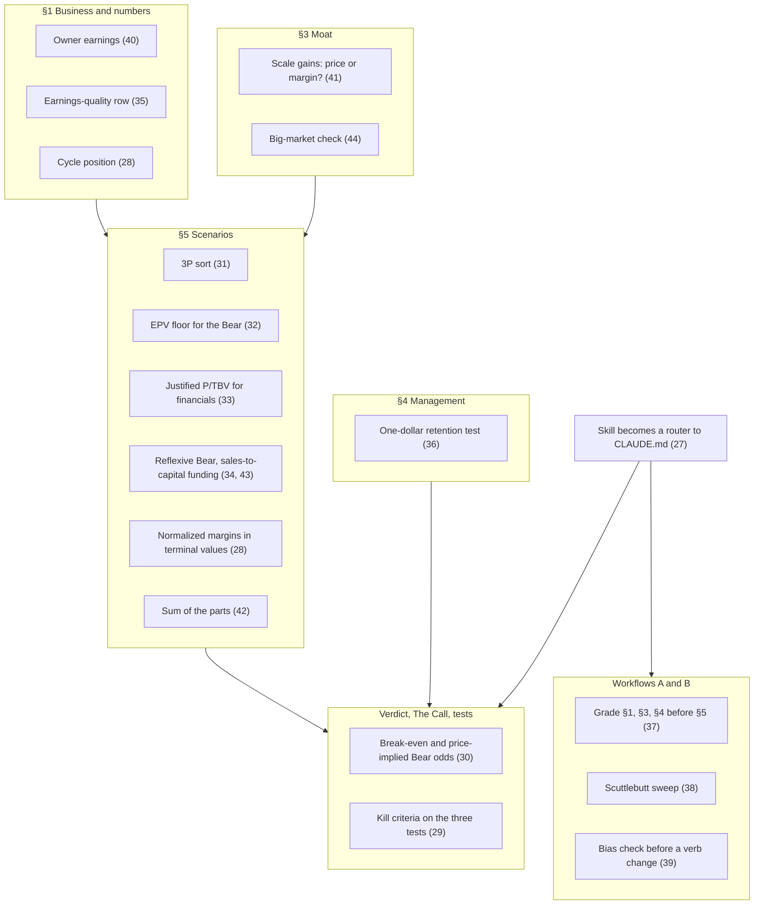

# Valuation Methods and Mental Models Beyond Mauboussin: A Study Report

2026-10-07 · Prepared for Karthik Gajjala · Companion to the [Mauboussin study](Mauboussin-frameworks-study-2026-10-07.md). The gap table here continues its numbering at row 27, so the two tables can be worked as one list.

Mauboussin gives our framework its spine: read the price, rebuild the economics from the unit up, ground forecasts in base rates, and act only on an edge you can name. This report asks what the rest of the value-investing and decision-science canon adds to a page that already has that spine. **Our valuation machinery is strong for steady compounders and weak in four places: cyclical earnings, financials, cash-hungry early-growth companies, and how robust a verb is to our own probability estimates. The mental models mostly confirm the structure we already have; their main contribution is to make our tests bite.** One prerequisite comes before any of it: the investment-analysis skill no longer matches the schema and has to be brought in line before anything else is added to it.

## 0. How to use this report

**What was read.** Primary texts verified in this session:
- Berkshire Hathaway's *Owner's Manual* and the 1986 shareholder letter (owner earnings).
- Munger's 1994 USC and 1995 Harvard talks.
- Howard Marks's memo *Dare to Be Great II*.
- Aswath Damodaran's NYU pages on valuing banks and cyclical companies, and two of his blog posts.
- Akre Capital's statement of philosophy.
- Fundsmith's published approach.
- George Soros's lecture on financial markets.
- Seth Klarman's 2009 Ivey talk.

The accounting screens (Sloan, Piotroski, Beneish, Altman, Novy-Marx) come from the papers' abstracts and the standard published formulas; I did not re-derive them. The books are summarized from secondary write-ups and my prior knowledge, so book-only details are less verified than the formulas: Greenwald, Klarman, Fisher, Lynch, Duke, Kahneman et al., Taleb, Soros, Mayer and the Nomad letters. Quotation is kept to one short phrase; everything else is paraphrase.

**How it is organized.**
- Section 1: the prerequisite (skill drift).
- Section 2: where the new tools land on the page.
- Section 3: valuation methods, each with a formula, a worked example and a proposal.
- Section 4: mental models, grouped by what they help you see.
- Section 5: what not to adopt.
- Section 6: three design tensions only you can resolve.
- Section 7: the gap table (rows 27–52).
- Sections 8 and 9: study plan and bibliography.

All worked examples are illustrative unless they say they use a page's numbers.

### The ideas on one page

1. **Sync the skill to the schema first.** It still prescribes allocation percentages, 1- and 3-year targets, and a multiples-only valuation (section 1).
2. **Value cyclicals on normalized earnings, never on the current margin.** Capitalizing a peak margin is the largest silent error our scenario method allows (section 3.3).
3. **Say how wrong the probabilities can be.** Give the Bear odds at which the call still clears 13%, and the Bear odds the price implies (section 3.7).
4. **Turn the three tests into kill criteria.** Each one carries a consequence decided when the test is written, not when it fails (section 4.4).
5. **Sort scenarios with Damodaran's 3P test.** Possible goes to optionality, plausible to Bull, probable to Base (section 3.3).
6. **Floor the Bear at earnings power.** A Bear below Greenwald's EPV has to name what breaks today's earnings, not just growth (section 3.2).
7. **Give financials their own warranted multiple.** Justified price-to-tangible-book follows from ROTE, growth and the cost of equity (section 3.3).
8. **Make the Bear reflexive where the stock price feeds the business.** Net out the capital the Bear needs (section 3.5).
9. **Screen earnings quality once, at ingest,** and mention it only when it trips (section 3.6).
10. **Most classic mental models are already built into the page.** Their value now is in process: what we commit to in advance, and the order we judge in (section 4).

## 1. Prerequisite: the skill has drifted from the schema

The `kg-investment-analysis` skill (v5.3, April 2026) predates CLAUDE.md v5.0 (September 2026) and now contradicts it in ways that matter more than any model we might add.

| Topic | Skill v5.3 | CLAUDE.md v5.0 | Consequence |
|---|---|---|---|
| Verdict | Buy / Hold / Avoid · **Allocation % · Stock/options split** (Section 15) | Seven verbs; **no sizing anywhere** (R3) | Skill output breaks a core rule |
| Horizon | 1-year and 3-year targets | One 5-year lens (R8) | Targets not comparable with wiki pages |
| Valuation | Multiples and a peer table → Stretched / Fair / Discounted | PW EV, 13% hurdle, hurdle-derived entry, return decomposition | The skill has no gate |
| Economics | Annual metrics table, FCF conversion | Driver tree, invested capital, ROIC, 3-yr ROIIC, reinvestment rate (R16) | The skill cannot make a compounder argument |
| Price history | A full section with a technical verdict | Technicals are context, never load-bearing (R8) | Weight on the wrong evidence |
| Management | Track record, insider ownership | Incentives, guidance grade, promises ledger, Outsider grade | Nothing auditable |
| Output | A styled HTML file | The wiki page, kept in place, plus the changelog | Two artifacts in two formats |

**Recommendation (row 27, High):** rewrite the skill as a thin router to the schema instead of a parallel specification.
- Mode A runs Workflow A.
- Mode B runs a Workflow B earnings update.
- Modes C and D stay as lightweight, read-only answers that cite the page.

The skill should state rules only by reference to CLAUDE.md and the framework files, never restate them, so every model we adopt is written once. Until then, each adoption below would have to be made twice, and the two copies would drift again.

## 2. Where the new tools land

Numbers in brackets are gap-table rows (section 7).

## 3. Valuation methods

### 3.1 Buffett: owner earnings and the one-dollar test

**Intrinsic value**, as Berkshire's *Owner's Manual* defines it, is the discounted cash that can be taken out of a business over its remaining life. It is an estimate rather than a figure, and it moves with interest rates and forecasts. Our PW EV is the same idea, expressed as a range of five-year outcomes instead of a point.

**Owner earnings** (1986 letter): reported earnings, plus depreciation, amortization and other non-cash charges, minus the average annual capital spending the business needs to keep its competitive position and unit volume, plus any working capital that requires. Buffett was explicit that the maintenance figure is a guess. He also said that cash-flow numbers which ignore it overstate what owners actually earn.

Two rows of the Mauboussin table already compute this: FCF after SBC (row 4) and maintenance versus growth investment (row 14). **Proposal (row 40, Low):** adopt *owner earnings* as the single name for the cash number the page compounds, defined once in `compounding.md`:

$$\text{Owner earnings} = \text{CFO} - \text{SBC} - \text{maintenance capex} - \text{lease principal}$$

Growth capex then belongs in the reinvestment rate, not in owner earnings. `Compounding/yr` in the Verdict table becomes growth in owner earnings per share, plus shareholder yield.

**The one-dollar test** (*Owner's Manual*, principle 9). Retaining earnings is justified if it delivers at least "$1 of market value for each $1 retained", measured on a rolling five-year basis. Buffett later corrected his own wording. A market that falls over five years can fail a good allocator, so the test should be read against the market (did value per share beat the S&P?) rather than in absolute terms. For any company:

$$\text{Market value per dollar retained} = \frac{\Delta\,\text{market cap over 5 years}}{\sum\left(\text{net income} - \text{dividends} - \text{net buybacks}\right)}$$

Net equity issuance enters as negative buybacks, so capital raised counts as capital retained.
- **Illustration:** cumulative net income $10B, dividends $3B and net buybacks $2B leave $5B retained. If market cap rose $8B, that is **$1.60 per $1 retained**.
- **Edge case:** when retained capital is negative (the company distributes more than it earns), the ratio means nothing; write `n/m`.

**Proposal (row 36, Medium):** add this as one evidence line in the §4 capital-allocation record.
- It is the *outcome* test that complements Mauboussin's *process* tests (row 11: golden rule, SBC-versus-buyback coherence, SVAR).
- It is cheap: three XBRL series and two prices.

**Look-through earnings** (*Owner's Manual*): an investee's undistributed earnings count as yours if the investee retains them well. R8 already values stakes as separate optionality lines, and `asset-types.md` lists look-through P/E for BRK.B. No change.

### 3.2 Greenwald: three layers of value and a floor for the Bear

Bruce Greenwald's Columbia method (*Value Investing: From Graham to Buffett and Beyond*, 2001; second edition 2020) values a business in three layers, from most to least reliable:

1. **Asset value.** What an efficient entrant would pay to reproduce the assets. It rests on the balance sheet, so it is the most reliable number.
2. **Earnings power value (EPV).** Sustainable, normalized after-tax operating earnings, adjusted for maintenance capex and capitalized at the cost of capital, with no growth.
3. **Growth value.** What growth adds above EPV; the least reliable layer.

Comparing the layers does the analysis.
- EPV well above asset value means a franchise: a moat.
- EPV near asset value means competition has pushed returns down to the cost of capital. Then **growth is worth nothing**, because new capital earns only its cost.
- So growth adds value only inside a franchise.

The link to our §1 is direct. If reproduction cost is approximated by operating invested capital, with intangibles capitalized (Mauboussin row 18):

$$\frac{\text{EPV}}{\text{Invested capital}} = \frac{\text{NOPAT}/r}{\text{IC}} = \frac{\text{ROIC}}{r}$$

Greenwald's franchise test is therefore our ROIC row divided by the discount rate.
- **Illustration:** NOPAT $1.0B at r = 9% gives EPV of $11.1B. With $5B of invested capital, EPV/IC = 2.2, the same as ROIC of 20% ÷ 9%.
- **Overlap:** the growth layer's share of value, 1 − EPV/EV, is the same object as Mauboussin's PVGO share (row 7). Adopt it once, not twice.

What Greenwald adds, and we lack, is **a discipline on the Bear case (row 32, Medium):**
- A Bear at EPV per share says "growth stops, the franchise holds." That is the natural floor for a moat business.
- A Bear *below* EPV must name what damages today's earnings power: a lost customer, a price war, a structural margin reset. Slower growth alone does not take value below EPV.
- On a page rated Moat: None, the Bull cannot rest on growth alone. Without a franchise, growth only earns its cost of capital.
- For the `mature ex-growth` stage, EPV is the valuation primary.

### 3.3 Damodaran: narrative discipline and the hard cases

Damodaran's value to us is less a single model than a set of fixes for the cases where a plain DCF or multiple goes wrong.

**The 3P test** (*Narrative and Numbers*, 2017). A valuation is a story turned into numbers, and the story must pass three filters of rising strictness: is it *possible*, *plausible*, *probable*? Many stories are possible, fewer are plausible, and few are probable. The test maps one-for-one onto our scenario structure and gives us a sorting rule (**row 31, Medium**):

| 3P tier | Where it goes on our page | Test |
|---|---|---|
| Possible | Optionality line (probability × value), outside the core | Could happen; no reference class at this size has done it often |
| Plausible | Bull | Its growth rate clears a stated base-rate floor in `compounding.md` §6 |
| Probable | Base | Reconciles to the reinvestment math (`compounding.md` §2) and sits near the middle of the reference class |

The floor is ours to set; 5% of the size bucket is a reasonable start.
- **Example:** a Bull assuming 20% real growth for five years at a company with more than $25B of sales sits at a 2.0% base rate. Under a 5% floor that is possible, not plausible.
- **Consequence:** the growth above what is plausible moves to the optionality line, so the core case reads without it.

**Terminal growth and the risk-free cap.** Damodaran caps perpetual growth at the risk-free rate used in the valuation ([*Myth 5.2*](https://aswathdamodaran.substack.com/p/myth-52-as-g-rto-infinity-and-beyond-16-11-30), November 2016). He gives two reasons: nominal rates and nominal growth have tracked each other, and the cap stops analysts reverse-engineering the answer they want.
- **Today:** with the 10-year Treasury at 5.31% ([FRED DGS10](https://fred.stlouisfed.org/series/DGS10), 2026-10-05), the cap does not bind against the 3% terminal growth in `compounding.md`.
- **Where it bites:** in the exit multiples our scenarios pick, each of which implies a growth rate.
- **Proposal (row 45, Low):** when the warranted-multiple check (Mauboussin row 2) backs out the growth a terminal multiple implies, flag it if that growth exceeds the risk-free rate.

**Sales-to-capital.** This is Damodaran's reinvestment link for companies whose ROIC is not yet meaningful:

$$\text{Reinvestment} = \frac{\Delta\,\text{revenue}}{\text{sales} \div \text{invested capital}}$$

The company's or the sector's sales-to-capital ratio is steadier than year-to-year capex. On an `early growth` page it answers the question ROIIC cannot: **can the Bull be funded?**
- **Illustration:** taking revenue from $5B to $15B at a sales-to-capital ratio of 1.5 needs about $6.7B of cumulative reinvestment.
- **Funding gap:** if operating cash covers $2B of that, the Bull needs $4.7B of outside capital. Section 3.5 shows what that does to per-share value (row 43, merged into row 34).

**Financials: justified price-to-book.** For banks, brokers and insurers, debt is raw material rather than financing, so EV multiples and ROIC stop working. Damodaran values these firms on equity ([bank value drivers](https://pages.stern.nyu.edu/~adamodar/New_Home_Page/littlebook/bankvaluedriver.htm)):
- the number that matters is the long-run return on equity;
- reinvestment is the capital regulators require;
- growth = ROE × retention.

The warranted multiple follows from the stable-growth dividend model:

$$\frac{P}{B} = \frac{\text{ROE} - g}{r - g}$$

At r = 10%:

| ROE | g | Justified P/B |
|---|---|---|
| 12% | 4% | 1.33× |
| 18% | 5% | 2.6× |
| 25% | 6% | 4.75× |

Use tangible book and return on tangible equity. **Proposal (row 33, Medium):** for the brokerage/fintech, mortgage and insurer asset types (SCHW, HOOD, RKT, BRK.B), each scenario's five-year terminal P/TBV must be the one its terminal ROTE justifies. This is Mauboussin's warranted-multiple check (row 2) in the form financials need.

**Cyclicals and commodity businesses: normalize.** A cyclical's current earnings tell you where the cycle is, not what the business earns. Damodaran normalizes in three ways ([cyclical and commodity value drivers](https://pages.stern.nyu.edu/~adamodar/New_Home_Page/littlebook/commodityvaluedrivers.htm)):
- average earnings over a full cycle;
- better, average a scaled ratio such as operating margin and apply it to current revenue;
- or use sector averages.

For commodity prices he prefers the market's forward curve to his own forecast. Peter Lynch made the same point from the other side: a cyclical looks cheapest on P/E at the peak, just before earnings fall, and dearest at the trough.

This is the largest gap in our current machinery. A five-year scenario multiplies a terminal-year margin by a terminal multiple. If that margin is today's and today's is a peak, the page capitalizes a peak.
- **Illustration:** revenue $10B, with operating margins over the past decade between 6% and 18%, a median of 11% and a current 17%. At 12× EBIT, current earnings imply $20.4B of enterprise value; normalized earnings imply $13.2B.
- That is **35% less, from one assumption nobody wrote down.**

**Proposal (row 28, High):**
- **Flag the page as cyclical** when either holds:
  - its asset type is cycle-exposed: industrial materials, capital-intensive OEM, mortgage and housing finance, logistics, or housing-linked retail;
  - its operating margin has swung widely over the past decade.
- **Candidates in our book, to confirm page by page:** TREX, MP, ACLS, DELL, RKT, HD, LOW, RH and FDX, plus SCHW and HOOD for rate and activity cycles.
- **§1 adds one line, cycle position:** the current operating margin as a percentile of its 10-year range, with the median.
- **§5 terminal values use the normalized margin in all three scenarios.** The scenarios then differ in the normalized level (a structural improvement in Bull, a structural reset in Bear), not in where year five happens to fall in the cycle.
- **An above-median Bull margin needs a reason:** a Bull that keeps one must point to the margin lever in §2 that makes it structural.
- **The multiples row shows P/E and EV/EBIT on normalized earnings** beside the reported ones.

**Failure probability.** For young or heavily levered companies, Damodaran values the going concern and the distress case separately and weights them by an explicit probability of failure. Mauboussin row 22 proposes the odds of a terminal event by year ten. On `early growth` and levered pages, that should become a five-year line in §5 with its own value, which is often close to zero (merged into row 47).

**The big-market delusion** ([Cornell and Damodaran, *Financial Analysts Journal*, 2020](https://ideas.repec.org/a/taf/ufajxx/v76y2020i2p15-25.html); [blog summary](https://aswathdamodaran.substack.com/p/the-market-is-huge-revisiting-the-19-12-30)). When a market is huge and the winners are not yet known, overconfident founders and investors price every contender as if it will win. The group ends up overvalued even when each story is plausible on its own.

The test is arithmetic: back out the revenue each company's price implies at a future date, add them up, and compare the total with the market's plausible size. Several of our pages share a market: vehicles and autonomy (TSLA, RIVN, UBER) and delivery (DASH, UBER). **Proposal (row 44, Low):** when two or more pages model the same market, each page's §3 TAM line states the share of that market our pages' Base cases assume together.

### 3.4 Sum of the parts

For businesses whose segments differ in unit, growth and economics, a single consolidated multiple averages things that should not be averaged. Examples: AMZN, DIS, BRK.B, SPCX, and CPNG's two segments.

The standard method:
1. Build a driver tree and pick a valuation primary for each segment, from `asset-types.md`.
2. Capitalize corporate costs and deduct them.
3. Deduct net debt.
4. Apply a holding-company discount only where capital is trapped or governance stops it being realized.
5. Cross-check the sum against the consolidated multiple and explain the gap.

`asset-types.md` already says "sum of parts" for AMZN. **Proposal (row 42, Low):** write the method once in `compounding.md` and use it on every page whose segments fall under different asset types.

### 3.5 When the share price changes the business

Soros's reflexivity ([lecture on financial markets](https://www.opensocietyfoundations.org/uploads/2b96bb8c-e2e1-4d88-9eea-badf16d0a2b8/george-soros-financial-markets-transcript.pdf); *The Alchemy of Finance*, 1987) holds that prices do not only reflect fundamentals; in some settings they change them. His central example is the 1960s conglomerate boom, a self-reinforcing loop:
1. High multiples let conglomerates buy companies with their own stock.
2. The acquisitions raised earnings per share.
3. The market rewarded the rise with still higher multiples.
4. The loop ran until targets and accounting tricks ran out.

Our scenarios implicitly treat a business as independent of its share price. For most of the book that is fine. It is wrong where one of these loops exists:

| Loop | How a falling price damages the business | Pages to check |
|---|---|---|
| Funding | The company needs outside equity; a lower price means more dilution for the same dollars | Cash-consuming early-growth pages (RIVN) |
| Talent | Underwater equity awards force more shares or more cash pay to keep people | Software and platform pages with a high SBC row |
| Activity | Revenue rises and falls with market prices and trading | Brokerages (HOOD; SCHW to a lesser degree) |
| Confidence | Customers, suppliers or lenders read the price as a signal of viability | Durable-goods makers not yet at scale (RIVN) |
| Currency | Acquisition strategies funded with stock stall | Serial acquirers |

**Proposal (row 34, Medium):** where a loop applies, the Bear must be reflexive. The minimum rule is to **net out the capital the Bear needs**:

$$\text{Bear value per share} = \frac{\text{Bear equity value} - \text{outside capital the Bear requires}}{\text{current shares}}$$

That is what issuing stock at a fair price comes to. Issuing below value costs more.
- **Illustration:** a Bear equity value of $6B, 1.0B shares and $2B to raise gives $4.00 a share, not the naive $6.00.
- **Forced raise:** if the company is forced to raise at $3, value falls to $3.60.
- **Inputs:** sales-to-capital (section 3.3) supplies the funding need. The talent and activity loops belong in the Bear's operating assumptions, named in §6.

### 3.6 Earnings-quality screens

Five academic screens are widely used to catch accounting that flatters earnings or hides distress. None is a reason to buy; each is a cheap reason to look harder.

| Screen | Measures | Construction | Signal | Caveat |
|---|---|---|---|---|
| [Sloan accruals](https://www.cuhk.edu.hk/acy2/workshop/June2009Wasley/1996TAR%29.pdf) (1996) | How much of earnings is not cash | Accruals ÷ average total assets | High-accrual firms had less persistent earnings and lower future returns | The return anomaly has largely faded since publication ([Green, Hand & Soliman, 2011](https://pure.psu.edu/en/publications/going-going-gone-the-apparent-demise-of-the-accruals-anomaly/)); use it as a quality flag, not a return signal |
| [Beneish M-score](https://en.wikipedia.org/wiki/Beneish_M-score) (1999) | Likelihood of earnings manipulation | Eight indices: receivables (DSRI), gross margin (GMI), asset quality (AQI), sales growth (SGI), depreciation (DEPI), SG&A (SGAI), leverage (LVGI), accruals (TATA) | Above −1.78 flags likely manipulation | Sales growth carries a large weight (0.892), so fast growers trip it; read DSRI and TATA, not only the total |
| [Piotroski F-score](https://www.aaii.com/journal/article/simple-methods-to-improve-the-piotroski-f-score) (2000) | Direction of fundamentals in cheap stocks | Nine binary tests: ROA > 0, CFO > 0, ROA rising, CFO > net income; leverage falling, current ratio rising, no new shares; gross margin rising, asset turnover rising | Selecting the financially strong raised a high book-to-market investor's return by at least 7.5% a year in his sample | Built for value stocks; noisy for growth companies |
| [Altman Z](https://en.wikipedia.org/wiki/Altman_Z-score) (1968) | Bankruptcy risk | 1.2·WC/TA + 1.4·RE/TA + 3.3·EBIT/TA + 0.6·MVE/TL + 1.0·Sales/TA | Below 1.81 distress; above 2.99 safe | Built for public manufacturers; our survivability rows do this job better for most pages |
| [Novy-Marx gross profitability](https://nber.org/papers/w15940) (2013) | Underlying profitability | Gross profit ÷ total assets | Predicts returns about as well as book-to-market | A factor, not a test; supports gross margin as moat evidence in `powers.md` |

Our §1 already carries the core of Piotroski's accrual test: FCF conversion (FCF ÷ net income) is the CFO-versus-net-income signal. One refinement matters for our book:
- Stock-based compensation is added back to operating cash flow.
- So a high-SBC company shows cash earnings above accounting earnings, and *looks* high-quality on an accrual test while paying its people in shares.
- **Measure accruals against CFO after SBC.**

**Proposal (row 35, Medium):** add one **earnings-quality** row to the §1 quality block, computed from XBRL on every ingest and mentioned in the text only when one of them trips:
- SBC-adjusted accruals as a share of average total assets;
- the Beneish M-score.

Piotroski's score becomes a Workflow B check for `turnaround`-stage pages only (row 46, Low). Altman Z stays out except for levered manufacturers.

### 3.7 Two numbers that say how wrong our probabilities can be

This tool is derived, not borrowed. Scenario probabilities are the least reliable input on the page; Mauboussin's calibration work (Mauboussin study, section 12) shows forecasters are overconfident. Yet the verb depends on them. Two numbers in the return-math table would show how far they can move before the verb changes.

Hold the Bull-to-Base mix fixed and let only the Bear's share vary:

$$V_{nb} = \frac{p_{\text{bull}}\cdot\text{Bull} + p_{\text{base}}\cdot\text{Base}}{p_{\text{bull}} + p_{\text{base}}}, \qquad p^{*}_{\text{bear}}(h) = \frac{V_{nb} - \text{spot}\cdot(1+h-y)^{5}}{V_{nb} - \text{Bear}}$$

- **Break-even Bear odds**, at h = 13%: the highest Bear probability at which the PW case still clears the hurdle.
- **Price-implied Bear odds**, at h = the page's discount rate (8–11%, `compounding.md` §5): the Bear probability at which today's price earns an ordinary return. This is the reverse DCF in scenario terms. It turns "what the market is pricing" into a probability we can set beside our own.

**Worked example.** Inputs:
- Scenarios: the DKS set in `moneyball.md` (Bull $330 at 20%, Base $215 at 50%, Bear $100 at 30%).
- Spot and yield: $139 and 3.6%, from the worked example in `compounding.md`.

The arithmetic:
1. V_nb is $247.86.
2. Clearing the 13% hurdle needs a PW EV of $217.82, so **break-even Bear odds are 20%**, against the 30% we assign. The call misses the hurdle; the Bear would have to be a third less likely for it to pass.
3. At a 9% discount rate, spot needs $180.81, so **the price implies 45% Bear odds.**

The variant perception becomes: "we think the Bear is 30% likely; the market prices 45%." That gives The Call a one-number statement of what the market has wrong.

**Proposal (row 30, High):** add both numbers to the return-math table on one line. If break-even odds are within ten points of the assigned odds, The Call states that the verb is fragile to the probabilities.

### 3.8 Which method, when

| Situation | Valuation primary | Floor | Warranted-multiple check | Extra line on the page |
|---|---|---|---|---|
| Mature compounder | Owner earnings × warranted multiple | EPV | ROIC, growth and fade (Mauboussin row 2) | — |
| Mature ex-growth | EPV | Asset value | Multiple ≈ 1 ÷ r | Yield carries the return |
| Cyclical | Normalized EBIT × mid-cycle multiple | EPV on normalized earnings | On normalized earnings | Cycle position |
| Financial | Justified P/TBV from ROTE | Tangible book | (ROE − g) ÷ (r − g) | ROTE vs. cost of equity |
| Early growth | Revenue × target margin × multiple, funded via sales-to-capital | Failure-weighted value | Implied terminal growth ≤ risk-free | Funding need and dilution |
| Multi-segment | Sum of the parts | Sum of segment floors | Per segment | Gap to consolidated multiple |
| Turnaround | EPV on restored margins, weighted by the odds of restoring them | Survival case | — | Piotroski trend |

This would be added to `asset-types.md`, keyed by stage and cyclicality rather than by type. The two tables meet in the `Valuation primary` column.

## 4. Mental models

Munger's case for a "latticework" ([USC, 1994](https://fs.blog/great-talks/a-lesson-on-worldly-wisdom/)) is that a few dozen big ideas from several disciplines, used together, beat deep knowledge of one. Read against our page, most of the investing classics turn out to be built in already. The table comes first, then the models that add something.

### 4.1 Already in the page

| Model | Source | Where it already lives |
|---|---|---|
| Second-level thinking: what is the consensus, how do I differ, why am I right | Marks, *The Most Important Thing* (2011); [*Dare to Be Great II*](https://www.oaktreecapital.com/insights/memo/dare-to-be-great-ii) (2014) | The Call: what the market has priced, what it has wrong |
| Inversion: ask how it fails | Munger, after Jacobi | "Breaks if" and the three Wrong-About tests |
| Over a long hold, the stock's return converges on the business's return on capital | Munger, USC 1994 | The lens; Compounding/yr at a flat multiple |
| Three-legged stool: an extraordinary business, talented management, a reinvestment runway | [Akre Capital](https://www.akrecapital.com/our-investment-philosophy/) | §1 and §3 (business), §4 (management), §2 with ROIIC × reinvestment (runway) |
| Buy good companies, don't overpay, do nothing; high cash returns on capital | [Fundsmith](https://www.fundsmith.co.uk/news/2010/2012-a-fundamental-approach-to-investing-from-terry-smith/) (Terry Smith) | R16 quality rows; the hurdle; a quiet week leaves the page untouched |
| Value is a range; risk is permanent loss, not volatility | Klarman, *Margin of Safety* (1991); [Ivey talk](https://www.ivey.uwo.ca/media/2815299/klarman-video-conference-2009.pdf) (2009) | Three scenarios; Bear % downside; R/R |
| Opportunity cost is the real hurdle | Munger; Buffett | The 13% hurdle; the watchlist ranking |
| Twin engines: earnings growth plus multiple expansion; most 100-baggers took decades | Phelps, *100 to 1 in the Stock Market* (1972); [Mayer, *100 Baggers*](https://www.theinvestorspodcast.com/articles/100-bagger-stocks/) (2015) | Return decomposition; re-rating is upside, not thesis; the year-ten sentence |
| Lollapalooza: several forces pushing the same way | Munger, Harvard 1995 | BAIT overlap |

Nothing in this table needs a change. The lineage still matters, because it shows where *not* to add: these ideas already cost us nothing.

### 4.2 Seeing the business

**Scuttlebutt** (Philip Fisher, [*Common Stocks and Uncommon Profits*](https://www.theinvestorspodcast.com/billionaire-book-club-executive-summary/common-stocks-and-uncommon-profits/), 1958). Fisher's fifteen points ask about:
- sales runway;
- R&D effectiveness and margins;
- labor relations;
- depth of management;
- cost controls;
- candor.

He answered them by talking to customers, suppliers, competitors and former employees. Our R9 sweeps what management says; nothing in the workflow sweeps what everyone else says about the company.

**Proposal (row 38, Medium):** add these sources to Workflow A step 2 and the Workflow B scan:
- competitors' transcripts and filings that mention the company;
- suppliers' and customers' 10-K disclosures (a supplier naming the company as a 10%-of-revenue customer is a read on volume);
- dated snapshots of public pricing pages, which supply the last-price-increase evidence for the customer block.

Third-party app, web and hiring data can be used if tagged per R4. This is where the "I" in BAIT comes from.

**Scale economies shared** (Nick Sleep and Qais Zakaria, Nomad Investment Partnership letters, 2001–2014; [summary](https://mastersinvest.com/newblog/2020/9/16/learning-from-nicholas-sleep)). Nomad's best ideas, Costco and Amazon, passed the savings from scale to customers as lower prices instead of keeping them as margin. The loop:
1. Lower prices bring more volume.
2. More volume brings more scale and more savings.
3. The moat widens with each turn, and the company is hard to attack because it is not over-earning.

A firm that harvests its scale as margin invites entry instead.

`powers.md` names scale economies as a Power but has no test for which way the gains flow. **Proposal (row 41, Low):** in §3's Trend row for scale-Power pages (AMZN, CPNG, CHWY), state whether scale gains go to price or to margin. Evidence:
- gross margin steady or falling while operating cost per unit falls;
- relative price against rivals;
- customer frequency rising.

Nomad's *destination analysis* (what the business looks like at maturity, and whether the path is consistent with it) is our year-ten sentence. No change.

**Lynch's six categories** (*One Up on Wall Street*, 1989): slow growers (roughly 2–4%), stalwarts (10–12%), fast growers (20–25%), cyclicals, turnarounds and asset plays. Each has a characteristic mistake:
- overpaying for a stalwart;
- missing the end of a fast grower's run;
- buying a cyclical on a low peak P/E;
- betting on a turnaround without the balance sheet to survive it.

Our lifecycle stages cover four of the six. The other two, **cyclical** and **asset play**, cut across stage. So they belong as a flag (row 28) and a method (sum of the parts, row 42), not as new stages (row 49).

### 4.3 Seeing the risk

**Ruin, fragility and Lindy** (Taleb, *Antifragile*, 2012; *Skin in the Game*, 2018). Where an outcome is irreversible (an "absorbing barrier"), averaging across scenarios misleads, because an investor lives through one path, not the average of all of them. What we already have:
- Our survivability rows (net debt/EBITDA, coverage, maturity wall) are the ruin check.
- Mauboussin's geometric-return check (row 17) handles dispersion.

**One rule is missing (row 47, Low):** when a ruin path exists, the Bear's value is what the equity is worth after ruin, often close to zero, not a trough multiple on trough earnings. Ruin paths include:
- an unfunded maturity inside five years;
- a covenant;
- a license;
- a customer who could leave and take most of the profit.

Damodaran's failure probability (section 3.3) merges here.
- **Lindy:** the effect (the longer a non-perishable thing has lasted, the longer it is likely to last) is a weak but honest prior for old brands and franchises (PEP, PG) against new ones. Use it as context in §3, not as a number.
- **Skin in the game:** already covered by the §4 insider-ownership and incentives lines.

**Premortem** (Gary Klein, *Harvard Business Review*, 2007; [overview](https://en.wikipedia.org/wiki/Pre-mortem)). Imagine a decision has already failed and explain why. This "prospective hindsight" surfaces more reasons than asking what might go wrong. At ingest, write the Bear from a premortem: "It is five years on and the stock has returned nothing. Why?" The top answers become the Bear's mechanism and candidates for the three tests. Merged into row 29.

### 4.4 Seeing ourselves

**Kill criteria** (Annie Duke, *Quit*, 2022; [interview](https://www.entrepreneur.com/growth-strategies/this-decision-making-expert-says-being-a-quitter-is/435835)). Decide in advance what would make you stop, as a *state* (a measurable condition) and a *date*. Commit to the action then, before you are attached.

Our Wrong-About tests already have a state and a date; what they lack is the action committed in advance. R13 and Workflow B step 3 say a failed test forces a scenario or verb change, "or an explicit sentence saying why not." That escape hatch is where consistency bias and the sunk-cost pull do their work.

**Proposal (row 29, High):** every test ends with **If Fail →** and a consequence decided when the test is written: either a named shift in scenario probabilities or a verb. The escape hatch stays, but it can be used only on evidence that did not exist when the test was written. Format:

> Net revenue retention stays at or above 110% in the next two 10-Qs (by 2027-03-31). **If Fail →** move 10 points from Bull to Bear; verb to Watch unless PW return still clears 13%.

This combines with Mauboussin's dated probabilistic signposts (row 10): each test gets a probability, a date and a consequence.

**Mediating assessments** (Kahneman, Lovallo and Sibony; *Noise*, 2021; [protocol summary](https://www.theuncertaintyproject.org/tools/the-mediating-assessments-protocol)). The protocol:
1. Break a judgment into a few separate assessments.
2. Make each one independently, from an outside view where possible.
3. Form the overall judgment only after all of them are done.

This stops one strong impression, usually the stock's price or story, from coloring everything else. Our page is already a set of mediating assessments; the gap is the order we write them in.

**Proposal (row 37, Medium):** in Workflow A step 4, commit three reads before building §5:
- the §1 quality read;
- the §3 moat rating and trend;
- the §4 management grades.

Do not revise them after seeing the PW return unless new evidence arrives. Workflow B already does this for the tests: step 3 scores them before the page is touched.

**Psychology of human misjudgment** (Munger, [Harvard, 1995](https://jamesclear.com/great-speeches/psychology-of-human-misjudgment-by-charlie-munger); later revised to 25 tendencies in *Poor Charlie's Almanack*). Five of the tendencies bear most on a wiki like ours:
- *Incentive-caused bias* in our sources: management guidance and sell-side targets, already kept out of verbs by R8.
- *Inconsistency avoidance*: defending the page's last verdict.
- *Social proof*: following an analyst cluster or the price.
- *Deprival super-reaction*: overweighting a fresh loss.
- *Availability*: overweighting the latest quarter.

**Proposal (row 39, Low):** ask five yes/no questions, one per tendency, before any verb change. Merge them into Mauboussin's drawdown READ-DO checklist (row 16) so there is one checklist, not two.

**Circle of competence** (Buffett and Munger). Know where your understanding ends and treat the edge honestly; Munger kept a "too hard" pile. Our book includes names whose outcomes turn on knowledge outside a generalist's circle: clinical pipelines at LNTH and LLY, launch economics at SPCX. Whether that should change the verb or only widen the scenarios is a design question for you (section 6, row 48).

## 5. What not to adopt

- **Sizing rules**, such as Kelly, Pabrai's case for a few large, infrequent bets, and position weights. R3 excludes them. Pabrai's other maxim, small downside with large upside, is already our R/R.
- **Market-level valuation timing**, such as CAPE or market cap to GDP. It is useful context among the `watchlist.md` macro items, never a reason for a verb (R8). Marks's maxim that you cannot predict but you can prepare points the same way.
- **PEG as a valuation primary.** Growth says nothing about value without the return on capital that funds it (section 3.2). Lynch used PEG as a heuristic for fast growers, not as a model.
- **Altman Z as a general screen.** It was built for 1960s manufacturers; our survivability rows work better for platforms, retailers and financials.
- **Graham net-nets and deep asset plays as a strategy.** They sit outside the compounding lens. Asset-play logic survives only as sum of the parts.
- **A single-point DCF with a precise WACC.** Klarman's point that value is a range is why we use scenarios and a hurdle; a point estimate would be a step back.

## 6. Three tensions only you can resolve

**1. Trim at PW EV versus "do nothing" for compounders.** Our Trim zone starts at PW EV. Fundsmith, Akre and the 100-bagger studies all argue that the costliest mistake with a true compounder is selling it early on valuation, because high-ROIIC businesses with long runways keep beating the estimates that made them look fully priced. The options:
- (a) keep Trim at PW EV on every page;
- (b) for `mature compounder` and `scaling` pages whose 3-year ROIIC is above some multiple of the hurdle, start Trim at Bull instead.

Both are verbs, not sizing, so either is consistent with R3.

**2. A fixed 13% hurdle versus one tied to interest rates.** With the 10-year Treasury at 5.31%, 13% is a 7.7-point premium; at 2021's roughly 1.5%, it was 11.5 points.
- Fundsmith judges free-cash-flow yield against long-term bond yields.
- Buffett and Munger treat the hurdle as an absolute opportunity cost.

A fixed hurdle is simpler and matches your teens-return goal; a rate-linked one keeps the equity premium constant. I recommend keeping it fixed and recording the spread as a `watchlist.md` macro item. But the hurdle is your number, and the memory notes it as still unconfirmed.

**3. Circle of competence as a gate or a width.** For pages outside our competence:
- (a) bar Initiate; or
- (b) allow Initiate but require wider scenarios and a stated confidence note (Mauboussin row 9).

Option (b) keeps the book open; option (a) is closer to Munger.

## 7. Gap table: rows 27–52

Rows continue the [Mauboussin table](Mauboussin-frameworks-study-2026-10-07.md). "Merges with" names the Mauboussin rows to decide in the same breath. The Decision column is for our working session.

| # | Idea (source, report section) | Our treatment today | Coverage | Proposed change | Home | Priority | Merges with | Decision |
|---|---|---|---|---|---|---|---|---|
| 27 | Skill drift (1) | Skill v5.3 restates an older spec: sizing, 1- and 3-year targets, multiples-only valuation | Conflicts | Rewrite SKILL.md as a router to Workflows A and B; state rules by reference only | SKILL.md | High | All | Proposed |
| 28 | Normalized margins and cycle position (Damodaran, Lynch; 3.3) | Terminal margin chosen per scenario; cycle not stated | Missing | Cyclical flag; §1 cycle-position line; terminal values on normalized margins; multiples on normalized earnings | `compounding.md`, `asset-types.md` | High | 5 | Proposed |
| 29 | Kill criteria and premortem (Duke, Klein; 4.3–4.4) | Tests have state and date; a failed test allows "a sentence why not" | Partial | Each test ends "If Fail →" with a consequence fixed when written; Bear written from a premortem at ingest | CLAUDE.md §4, §7 | High | 10 | Proposed |
| 30 | Break-even and price-implied Bear odds (derived; 3.7) | Probabilities stated; sensitivity not | Missing | One return-math line: Bear odds at which the PW case clears 13%, and Bear odds spot implies at r | `moneyball.md`, `compounding.md` | High | 1, 17 | Proposed |
| 31 | 3P test (Damodaran; 3.3) | Optionality split from core; base-rate line for the Bull | Partial | Possible → optionality; plausible → Bull (base rate above a set floor); probable → Base | `moneyball.md` | Medium | 5 | Proposed |
| 32 | EPV floor and franchise test (Greenwald; 3.2) | Bear mechanism named; no floor | Partial | A Bear below EPV must name what impairs current earnings power; Moat None → no growth premium; EPV primary for mature ex-growth | `moneyball.md` | Medium | 7 | Proposed |
| 33 | Justified P/TBV for financials (Damodaran; 3.3) | P/TBV named as primary; no warranted level | Partial | Terminal P/TBV = (ROTE − g) ÷ (r − g) in each scenario | `asset-types.md`, `compounding.md` | Medium | 2 | Proposed |
| 34 | Reflexive Bear (Soros; 3.5) | Bear assumes today's share count and operations independent of price | Missing | Where a loop applies, the Bear nets out the outside capital it needs; the loop is named in §6 | `moneyball.md` | Medium | — | Proposed |
| 35 | Earnings-quality row (Sloan, Beneish; 3.6) | FCF conversion row | Partial | SBC-adjusted accruals ÷ average assets and the Beneish M-score on ingest; text only when tripped | `compounding.md` | Medium | 4 | Proposed |
| 36 | One-dollar retention test (Buffett; 3.1) | Outsider grade anchored on buyback timing | Partial | 5-year Δ market cap ÷ retained capital, read against the S&P | `outsiders.md` | Medium | 11 | Proposed |
| 37 | Mediating assessments (Kahneman, Lovallo, Sibony; 4.4) | Sections are separate assessments; order not fixed | Partial | Commit §1, §3, §4 grades before building §5 in Workflow A | CLAUDE.md §6 | Medium | — | Proposed |
| 38 | Scuttlebutt (Fisher; 4.2) | R9 sweeps management only | Missing | Sweep competitor, supplier and customer filings and public pricing pages | CLAUDE.md §6, §7, §12 | Medium | 6 | Proposed |
| 39 | Misjudgment checklist (Munger; 4.4) | R8 keeps sell-side views out of verbs | Partial | Five yes/no questions before a verb change, in one checklist with row 16 | CLAUDE.md §7 | Low | 16 | Proposed |
| 40 | Owner earnings (Buffett; 3.1) | FCF as reported; D&A as maintenance | Partial | One definition: CFO − SBC − maintenance capex − lease principal | `compounding.md` | Low | 4, 14 | Proposed |
| 41 | Scale economies shared (Nomad; 4.2) | Scale Power named; direction of gains not | Partial | Trend row says whether scale gains go to price or to margin | `powers.md` | Low | 12 | Proposed |
| 42 | Sum of the parts (3.4) | Named for AMZN only | Partial | One method, used on every page with segments of different asset types | `compounding.md` | Low | — | Proposed |
| 43 | Sales-to-capital (Damodaran; 3.3) | ROIIC only | Partial | Funding need for early-growth Bulls | `compounding.md` | Low | 34 | Proposed |
| 44 | Big-market check (Cornell and Damodaran; 3.3) | TAM per page | Missing | §3 TAM line states the share of the market our pages' Base cases assume together | `powers.md` | Low | 21 | Proposed |
| 45 | Terminal growth ≤ risk-free rate (Damodaran; 3.3) | Fixed 3% terminal | Partial | Flag any exit multiple whose implied growth exceeds the risk-free rate | `compounding.md` | Low | 1, 2 | Proposed |
| 46 | Piotroski F for turnarounds (3.6) | — | Missing | Workflow B direction check on turnaround-stage pages | `compounding.md` | Low | — | Proposed |
| 47 | Ruin and failure probability (Taleb, Damodaran; 4.3) | Survivability rows | Partial | Where a ruin path exists, Bear = post-ruin equity value; explicit 5-year failure odds for early-growth and levered pages | `moneyball.md` | Low | 17, 22 | Proposed |
| 48 | Circle of competence (Buffett, Munger; 4.4, 6) | — | Missing | Your decision: a gate on Initiate, or wider scenarios with a confidence note | CLAUDE.md R8 | Decision | 9 | Proposed |
| 49 | Lynch's categories (4.2) | Lifecycle stages | Partial | No new stage; cyclical becomes a flag (28); asset plays use sum of the parts (42) | — | Low | — | Proposed |
| 50 | Trim zone for compounders (Fundsmith, Akre, Mayer; 6) | Trim from PW EV to Bull on every page | — | Your decision: keep, or start Trim at Bull for high-ROIIC compounders | CLAUDE.md R8 | Decision | — | Proposed |
| 51 | Hurdle fixed or rate-linked (Fundsmith vs. Buffett; 6) | Fixed 13% | — | Your decision; recommend fixed, with the spread to the 10-year logged | CLAUDE.md R8, `watchlist.md` | Decision | 24 | Proposed |
| 52 | Already in place (4.1): second-level thinking, inversion, Akre's stool, Fundsmith, Klarman, opportunity cost, twin engines, lollapalooza | The Call, Breaks if, R16 rows, hurdle, scenarios, BAIT | In place | No change | — | — | 23–25 | Proposed |

**Suggested order of work:**
1. Row 27: sync the skill, so every later change is written once.
2. The cheap, high-value process rows: 29 and 30.
3. Row 28: cyclicals, on the next cyclical page a material event touches.
4. The per-type valuation rows: 31–34.
5. Quality and process: 35–39.
6. The Low rows, as pages need them.

Every change follows CLAUDE.md §15: edit where the concept lives, replace rather than append, and apply on each page's next material touch, never as a bulk migration.

## 8. Study plan

About 68 hours, in six phases. The order runs from the valuation floor upward, then to the hard cases, then to judgment.

| Phase | Read | Why now | Exercise | Hours |
|---|---|---|---|---|
| 1. Floors and cash | Berkshire [*Owner's Manual*](https://www.berkshirehathaway.com/ownman.pdf) and [1986 letter](https://www.berkshirehathaway.com/letters/1986.html) (owner earnings section) | The definitions everything else uses | Owner earnings and the one-dollar test for one page | 1.5 |
| 1 | Greenwald et al., *Value Investing: From Graham to Buffett and Beyond* (2nd ed., 2020), chapters on asset value, EPV and franchise value | The floor under the Bear | Three layers for PEP or PG; compare EPV with the page's Bear | 6 |
| 2. Hard cases | Damodaran, *Narrative and Numbers* (2017) | Scenario discipline | 3P-sort one page's scenarios | 6 |
| 2 | Damodaran's [bank](https://pages.stern.nyu.edu/~adamodar/New_Home_Page/littlebook/bankvaluedriver.htm) and [cyclical](https://pages.stern.nyu.edu/~adamodar/New_Home_Page/littlebook/commodityvaluedrivers.htm) value-driver pages; [*Valuing Financial Service Firms*](https://ideas.repec.org/a/ris/jofipe/0001.html) (2013) | Financials and cyclicals | Justified P/TBV for SCHW; cycle position and normalized margin for one cyclical | 3 |
| 2 | Cornell and Damodaran (2020); [*Myth 5.2*](https://aswathdamodaran.substack.com/p/myth-52-as-g-rto-infinity-and-beyond-16-11-30) | Group overpricing; terminal growth | Sum Base-case revenue across our autonomy pages | 1.5 |
| 3. Accounting quality | Sloan (1996), Piotroski (2000), Beneish (1999): abstracts and method sections | Know what the screens catch | M-score and SBC-adjusted accruals for one high-SBC name | 4 |
| 4. Seeing the business | Fisher (1958); Lynch, *One Up on Wall Street* (1989); Nomad letters (selected years) | Scuttlebutt, categories, scale shared | A scuttlebutt sweep for one page; the scale-shared test for AMZN or CPNG | 14 |
| 5. Risk | Marks, *The Most Important Thing* (2011) and [*Dare to Be Great II*](https://www.oaktreecapital.com/insights/memo/dare-to-be-great-ii); Klarman, *Margin of Safety* (1991); Taleb, *Skin in the Game* (2018); Soros, *The Alchemy of Finance* (1987), chapters 1–2 | Permanent loss, ruin, reflexivity | Mark which pages carry a reflexive loop or a ruin path | 19 |
| 6. Judgment | Munger, [USC 1994](https://fs.blog/great-talks/a-lesson-on-worldly-wisdom/) and [Harvard 1995](https://jamesclear.com/great-speeches/psychology-of-human-misjudgment-by-charlie-munger); Duke, *Quit* (2022); Klein (2007); Kahneman, Sibony and Sunstein, *Noise* (2021), chapters on decision hygiene | Kill criteria and judgment order | Rewrite three live tests with "If Fail →" | 12.5 |

## 9. Bibliography

**Primary sources verified in this session**
- Berkshire Hathaway, [*Owner's Manual*](https://www.berkshirehathaway.com/ownman.pdf): intrinsic value; principle 9 and Buffett's later correction to it; look-through earnings.
- Buffett, [1986 Chairman's Letter](https://www.berkshirehathaway.com/letters/1986.html): owner earnings.
- Munger, [*A Lesson on Elementary Worldly Wisdom*](https://fs.blog/great-talks/a-lesson-on-worldly-wisdom/) (USC, 1994).
- Munger, [*The Psychology of Human Misjudgment*](https://jamesclear.com/great-speeches/psychology-of-human-misjudgment-by-charlie-munger) (Harvard, 1995).
- Marks, [*Dare to Be Great II*](https://www.oaktreecapital.com/insights/memo/dare-to-be-great-ii) (Oaktree memo, 2014).
- Damodaran:
  - [*Bank valuation: key drivers*](https://pages.stern.nyu.edu/~adamodar/New_Home_Page/littlebook/bankvaluedriver.htm);
  - [*Valuing cyclical and commodity companies*](https://pages.stern.nyu.edu/~adamodar/New_Home_Page/littlebook/commodityvaluedrivers.htm);
  - [*Myth 5.2: As g → r*](https://aswathdamodaran.substack.com/p/myth-52-as-g-rto-infinity-and-beyond-16-11-30) (2016);
  - [*The Market is Huge! Revisiting the Big Market Delusion*](https://aswathdamodaran.substack.com/p/the-market-is-huge-revisiting-the-19-12-30) (2019).
- Akre Capital Management, [*Our Investment Philosophy*](https://www.akrecapital.com/our-investment-philosophy/).
- Fundsmith, [*A fundamental approach to investing*](https://www.fundsmith.co.uk/news/2010/2012-a-fundamental-approach-to-investing-from-terry-smith/).
- Soros, [lecture on financial markets and reflexivity](https://www.opensocietyfoundations.org/uploads/2b96bb8c-e2e1-4d88-9eea-badf16d0a2b8/george-soros-financial-markets-transcript.pdf).
- Klarman, [Ivey Business School talk](https://www.ivey.uwo.ca/media/2815299/klarman-video-conference-2009.pdf) (2009).
- Federal Reserve Bank of St. Louis, [10-year Treasury yield (DGS10)](https://fred.stlouisfed.org/series/DGS10): 5.31% on 2026-10-05.

**Academic papers**
- Sloan, R., "Do Stock Prices Fully Reflect Information in Accruals and Cash Flows about Future Earnings?", *The Accounting Review* 71(3), 1996 ([PDF](https://www.cuhk.edu.hk/acy2/workshop/June2009Wasley/1996TAR%29.pdf)).
- Green, J., Hand, J. and Soliman, M., "Going, Going, Gone? The Apparent Demise of the Accruals Anomaly", *Management Science*, 2011 ([record](https://pure.psu.edu/en/publications/going-going-gone-the-apparent-demise-of-the-accruals-anomaly/)).
- Piotroski, J., "Value Investing: The Use of Historical Financial Statement Information to Separate Winners from Losers", *Journal of Accounting Research* 38, 2000 ([summary](https://www.aaii.com/journal/article/simple-methods-to-improve-the-piotroski-f-score)).
- Beneish, M., "The Detection of Earnings Manipulation", *Financial Analysts Journal*, 1999 ([formula reference](https://en.wikipedia.org/wiki/Beneish_M-score)).
- Altman, E., "Financial Ratios, Discriminant Analysis and the Prediction of Corporate Bankruptcy", *Journal of Finance*, 1968 ([formula reference](https://en.wikipedia.org/wiki/Altman_Z-score)).
- Novy-Marx, R., "The Other Side of Value: The Gross Profitability Premium", *Journal of Financial Economics*, 2013 ([NBER working paper](https://nber.org/papers/w15940)).
- Cornell, B. and Damodaran, A., "The Big Market Delusion: Valuation and Investment Implications", *Financial Analysts Journal* 76(2), 2020 ([record](https://ideas.repec.org/a/taf/ufajxx/v76y2020i2p15-25.html)).
- Damodaran, A., "Valuing Financial Service Firms", *Journal of Financial Perspectives* 1(1), 2013 ([record](https://ideas.repec.org/a/ris/jofipe/0001.html)).
- Klein, G., "Performing a Project Premortem", *Harvard Business Review* 85(9), 2007 ([overview](https://en.wikipedia.org/wiki/Pre-mortem)).

**Books, summarized from secondary sources**
- Greenwald, B., Kahn, J., Bellissimo, E., Cooper, M. and Santos, T., *Value Investing: From Graham to Buffett and Beyond*, 2nd ed., 2020 ([summary](https://www.antoinebuteau.com/lessons-from-bruce-greenwald.md)).
- Damodaran, A., *Narrative and Numbers*, 2017 ([CFA Institute interview](https://rpc.cfainstitute.org/blogs/enterprising-investor/2014/aswath-damodaran-the-most-reliable-investment-valuations-balance-numbers-and-narratives)).
- Fisher, P., *Common Stocks and Uncommon Profits*, 1958 ([summary](https://www.theinvestorspodcast.com/billionaire-book-club-executive-summary/common-stocks-and-uncommon-profits/)).
- Lynch, P., *One Up on Wall Street*, 1989 [link pending].
- Marks, H., *The Most Important Thing*, 2011; *Mastering the Market Cycle*, 2018 [link pending].
- Klarman, S., *Margin of Safety*, 1991 ([summary](https://novelinvestor.com/lessons-seth-klarmans-margin-safety/)).
- Sleep, N. and Zakaria, Q., Nomad Investment Partnership letters, 2001–2014 ([summary](https://mastersinvest.com/newblog/2020/9/16/learning-from-nicholas-sleep)).
- Phelps, T., *100 to 1 in the Stock Market*, 1972; Mayer, C., *100 Baggers*, 2015 ([summary](https://www.theinvestorspodcast.com/articles/100-bagger-stocks/)).
- Soros, G., *The Alchemy of Finance*, 1987 (see the lecture above).
- Taleb, N., *Antifragile*, 2012; *Skin in the Game*, 2018 ([Lindy effect](https://en.wikipedia.org/wiki/Lindy_effect)).
- Duke, A., *Quit*, 2022 ([interview](https://www.entrepreneur.com/growth-strategies/this-decision-making-expert-says-being-a-quitter-is/435835)).
- Kahneman, D., Sibony, O. and Sunstein, C., *Noise*, 2021 ([mediating-assessments protocol](https://www.theuncertaintyproject.org/tools/the-mediating-assessments-protocol)).
- Munger, C., *Poor Charlie's Almanack*, 2005 [link pending].
